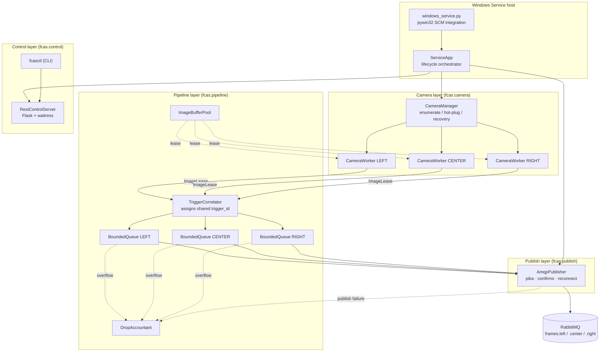
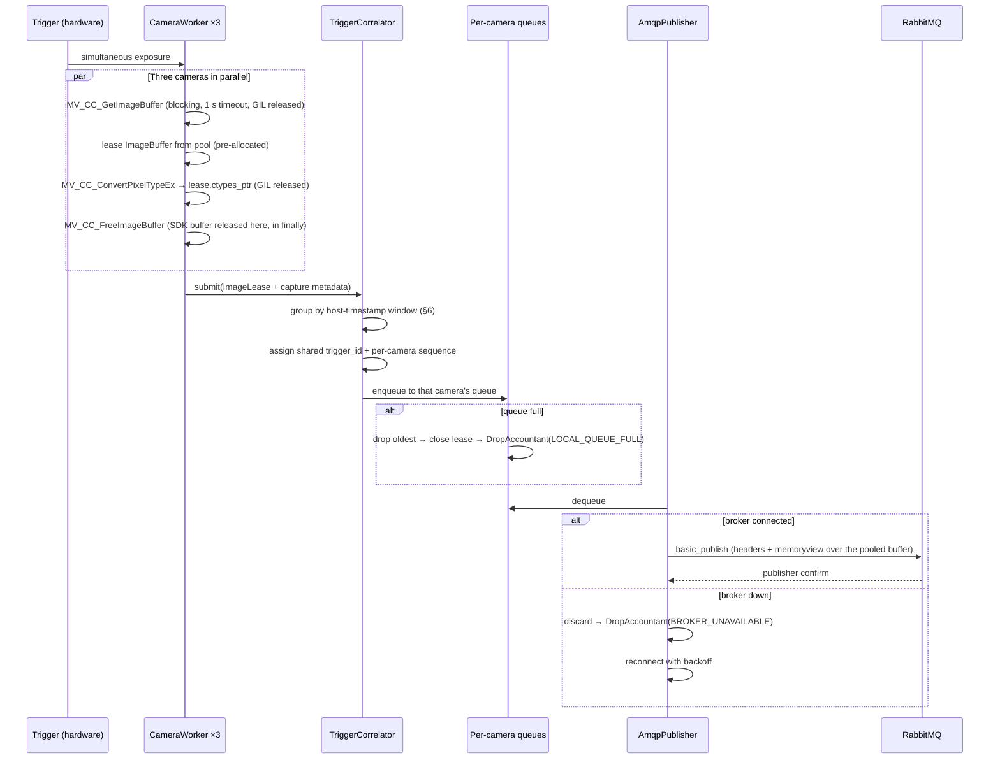
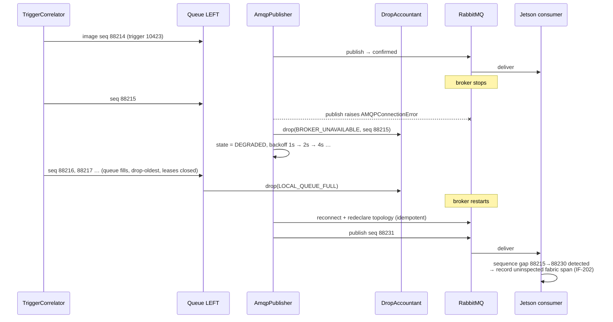

# Software Design Description
## Fabric Inspection — Camera Acquisition & Publishing Service (FCAS)

| Field | Value |
|---|---|
| Document | SDD — Camera Acquisition Service |
| Version | **3.0** (implementation language changed to Python) |
| Implements | `SRS-camera-acquisition-service.md` v3.0 |
| Target | Hikrobot MV-VC3501X-128G60, Windows / Windows IoT, x64 |
| Language / runtime | **Python 3.12 (CPython, 64-bit)**, pinned virtual environment |
| Key dependencies | **MVS Python SDK** (`MvImport`, ctypes — from the MVS install), **pika** (AMQP 0-9-1), **Flask** + **waitress** (REST), **pydantic v2** (config schema), **pywin32** (Windows Service + Event Log), **requests** (CLI), stdlib `logging` / `json` / `threading` |
| Dev tooling | **pytest**, **mypy --strict**, **ruff** |

### Revision history

| Ver | Change |
|---|---|
| 1.0 | Initial issue; gRPC streaming, protobuf Frame Sets, per-consumer sessions |
| 2.0 | **RabbitMQ transport.** Protobuf removed; pooled raw `ImageBuffer` replaces protobuf `Frame`; `FrameSetAssembler` → `TriggerCorrelator` (assigns shared ID, publishes per camera); `GrpcServer`/`ConsumerSession` → `AmqpPublisher` + `RestControlServer`; drop accounting split between local and broker-side |
| **3.0** | **C++17 → Python 3.12.** Component decomposition, threading model, correlation algorithm, state machine, drop accounting, and the entire external contract are **unchanged**. What changed is how the design is realised in the language: RAII → context managers plus a `weakref` safety net (§5.3); `Status` return values → an exception hierarchy at boundaries (§9); `std::vector<uint8_t>` pool → pinned `bytearray` with cached `ctypes` and `memoryview` views (§5.1); rabbitmq-c → `pika`; cpp-httplib → Flask + waitress; Win32 SCM → `pywin32`; GoogleTest → pytest. Added §4.5 (GIL analysis) and §16 (translation map) |

---

## 1. Purpose and scope

This document specifies **how** the FCAS requirements are realised: component decomposition,
threading model, memory and buffer ownership, trigger correlation, AMQP publishing, error
handling, and the concrete source structure for implementation.

It is the last document before code. Every design element traces to an SRS requirement (§13).

**Scope of the v3.0 port.** The language changed; the system did not. If an implementation
decision in this document looks like a behaviour change rather than a language change, that is a
defect in the port and must be raised, not absorbed. §16 maps every v2.0 component to its v3.0
counterpart so the two documents can be read side by side.

---

## 2. Design drivers

| Driver | Consequence |
|---|---|
| **Acquisition must never block on broker or network I/O** (FR-508) | Hard decoupling between capture and publish via bounded per-camera queues; broker runs locally so publish is a loopback operation |
| **24/7 with bounded memory** (NFR-105, NFR-201) | Buffer pool pre-allocated at startup — **zero** large allocations in steady state; every queue bounded; `gc.freeze()` after startup so the collector never re-walks the startup object graph |
| **Three cameras form one logical slice, but publish separately** (FR-304/305) | A correlator assigns one shared `trigger_id` before fan-out to three queues (§6) |
| **Best-effort with an audit trail** (FR-503, FR-506) | Two distinct drop points — local (FCAS knows) and broker-side (consumer detects via sequence gaps) — both accounted (§7.8) |
| **Partial failure must degrade, not stop** (FR-106, NFR-206, NFR-208) | Per-camera thread isolation; broker loss yields `DEGRADED`, never halts acquisition |
| **Python has no destructors you can rely on** (CON-011) | Every vendor resource — SDK frame, device handle, pooled buffer, AMQP connection — is acquired through a **context manager**, never by bare call. A `weakref.finalize` safety net converts a leaked lease from a silent 15 MB loss into a logged `ERROR` (§5.3) |
| **Python has no compiler to catch interface drift** (NFR-305) | `mypy --strict` and `ruff` are build gates. The `ctypes` boundary is wrapped once, in one module, and typed; no other module sees an untyped SDK symbol |

---

## 3. Architectural overview



**Layer rule:** dependencies point downward only. The camera layer knows nothing about AMQP;
the publish layer knows nothing about the MVS SDK. The currency crossing the pipeline is a
pooled `ImageBuffer` plus a plain metadata dataclass.

**Import rule (the Python form of the layer rule).** `MvImport` symbols are importable **only**
inside `fcas/camera/mvs_sdk.py`; `pika` symbols **only** inside `fcas/publish/`. Both are enforced
by a lint rule and by a test that walks the import graph, because in Python nothing else prevents
a stray import from silently crossing the boundary.

---

## 4. Threading model

Unchanged from v2.0. Seven roles, same responsibilities, same blocking behaviour.

| # | Thread | Count | Responsibility | Blocking behaviour |
|---|---|---|---|---|
| T1 | **Service control** | 1 | SCM handler (`SvcDoRun` / `SvcStop`), start/stop dispatch | Waits on a `threading.Event` |
| T2 | **CameraWorker** | 1 **per camera** (3) | `MV_CC_GetImageBuffer` → debayer → hand off | Blocks in the SDK, 1 s timeout |
| T3 | **TriggerCorrelator** | 1 | Group frames into trigger events, assign shared `trigger_id`, fan out to per-camera queues | `threading.Condition.wait(timeout)` |
| T4 | **CameraMonitor** | 1 | Poll enumeration, detect hot-plug, drive the camera connection recovery loop | `Event.wait(3.0)` — interruptible sleep |
| T5 | **AmqpPublisher** | 1 | Drain the three queues, publish to broker, handle confirms and reconnect | Blocks on the pika socket write |
| T6 | **RestControlServer** | small pool | Serve UI/CLI control and status requests | waitress-managed |
| T7 | **HealthMonitor** | 1 | Aggregate metrics, watchdog checks, publish telemetry | `Event.wait(1.0)` |

**All sleeps are `Event.wait(timeout)`, never `time.sleep`.** A stop request must be able to
abort any wait immediately so shutdown fits the 10 s budget (OP-104) — including a wait in the
middle of a 30 s reconnect backoff.

### 4.1 Why one thread per camera

`MV_CC_GetImageBuffer` is a per-handle blocking call. One thread per camera gives fault
isolation (a hung camera blocks only its own thread — FR-106, NFR-206), parallel debayering
across cores, and matches the vendor's validated `MultipleCameras` sample. The SDK callback API
(`MV_CC_RegisterImageCallBackEx`) is deliberately not used: callbacks fire on SDK-owned threads,
which in a `ctypes` binding means a foreign thread entering the interpreter and taking the GIL at
a moment we do not control, with implicit buffer lifetime rules on top. Blocking pull keeps every
Python frame on a thread we created and joined.

### 4.2 Why a single publisher thread

`pika` connections and channels are **not thread-safe**; a `BlockingConnection` must be used from
exactly one thread. A single publisher thread owning one connection avoids all locking around the
AMQP client, and is comfortably sufficient: three 15 MB publishes per trigger over loopback are
expected to take on the order of 150–250 ms, against a 2 800 ms trigger interval (≈5–9% duty).
At the NFR-103 stress rate of 2 triggers/s it is still well under half duty — a figure Unit 13
must confirm rather than assume.

*If per-camera publish isolation is ever required, the design extends to one publisher thread and
one connection per camera without touching any other component — the per-camera queues are
already the seam.*

### 4.3 Thread interaction



### 4.4 Synchronisation inventory

| Shared state | Protection | Notes |
|---|---|---|
| `ImageBufferPool` free-list | `threading.Lock` | Held only for a `deque` pop/append — never during debayer or I/O |
| Correlator pending group | `threading.Condition` | Owned solely by T3; workers only push to its inbox |
| Per-camera publish queues | `threading.Condition`, bounded | Independent per camera — one camera's backlog cannot affect another |
| Camera registry | `threading.RLock` | Read-heavy (status), write-rare (hot-plug). Python has no shared/exclusive lock in the stdlib; the critical sections are microseconds of dict access, so a plain lock is correct and simpler than importing a reader-writer implementation |
| pika connection / channel | **None** — thread-confined to T5 | The reason for a single publisher thread |
| Metrics / drop counters | `threading.Lock` around a counters object | See note below |

> **On "atomic" counters.** The C++ design used `std::atomic` on the hot path. CPython has no
> equivalent primitive, and `+=` on an `int` attribute is *not* atomic. At ~1 increment/s per
> counter the cost of a lock is irrelevant, so `Metrics` takes a single short-held lock for
> increment and for snapshot. This is simpler and more obviously correct than reasoning about
> which bytecode sequences happen to be safe under the current interpreter.

**Lock discipline:** no lock is ever held across a blocking SDK call, a debayer operation, or an
AMQP publish. Hold times are bounded to container manipulation and counter updates.

### 4.5 Does the GIL invalidate this threading model?

No — and the reason is specific enough to be worth recording, because it is the first question
anyone will ask about a threaded Python service.

The two expensive operations per frame are `MV_CC_GetImageBuffer` (blocking wait for the camera)
and `MV_CC_ConvertPixelTypeEx` (the debayer, which dominates CPU). Both are foreign calls through
`ctypes`. `MvCameraControl_class.py` loads the vendor DLL with `WinDLL`, and `ctypes` **releases
the GIL for the duration of every call** made through a `WinDLL`/`CDLL` handle. Three camera
threads therefore block and debayer genuinely in parallel; the GIL is held only for the short
stretches of Python bytecode between SDK calls (ASM-009).

The Python-level work per frame is a few hundred bytecodes: build a metadata dataclass, take a
lock, append to a deque, notify a condition. At the nominal 0.36 trigger/s — and at the NFR-103
stress rate of 2/s — GIL contention is not a factor.

**Alternatives considered and rejected:**

| Option | Why not |
|---|---|
| `asyncio` | The MVS SDK is a blocking C API with no awaitable surface. Every camera would need a thread-pool executor anyway, so the event loop adds a second concurrency model and its failure modes for no gain. `pika`'s blocking adapter would also have to be replaced or wrapped. |
| `multiprocessing` (one process per camera) | 15 MB frames would have to cross a process boundary — shared memory plus a second copy, plus process supervision, plus a distributed shutdown story. All of this to parallelise Python bytecode that is not the bottleneck. |
| Free-threaded CPython (3.13t) | Removes a constraint that is not binding, in exchange for a runtime with immature wheel availability for `pywin32` and `pydantic`. Revisit only if measurement shows GIL contention, which the analysis above says it will not. |

Unit 13 measures per-stage timings (§15 step 12); if this analysis is wrong, that is where it
shows up, and the finding goes in `Documents/validation-report.md`.

---

## 5. Memory and buffer ownership

### 5.1 Pre-allocated pool — zero steady-state allocation

Allocating and freeing 15 MB blocks continuously for months invites heap fragmentation and,
in CPython, unpredictable arena retention (NFR-105). The pool allocates **every buffer once, at
startup**, and never resizes thereafter.

Each `ImageBuffer` is one `bytearray` plus two views onto it, both created once:

```python
class ImageBuffer:
    """One pre-allocated frame buffer. Allocated at startup, never resized, never copied."""

    __slots__ = ("_data", "_ctypes_view", "_view", "capacity")

    def __init__(self, frame_bytes: int) -> None:
        self._data = bytearray(frame_bytes)
        # Pins the bytearray: while this view exists the object cannot be resized.
        # That is exactly the invariant we want, and it is enforced by the interpreter.
        self._ctypes_view = (ctypes.c_ubyte * frame_bytes).from_buffer(self._data)
        self._view = memoryview(self._data)
        self.capacity = frame_bytes

    @property
    def ctypes_ptr(self) -> "ctypes._Pointer[ctypes.c_ubyte]":
        """Destination for MV_CC_ConvertPixelTypeEx.pDstBuffer — the SDK writes in place."""
        return ctypes.cast(self._ctypes_view, ctypes.POINTER(ctypes.c_ubyte))

    def body(self, length: int) -> memoryview:
        """Zero-copy message body for pika.basic_publish."""
        return self._view[:length]
```

Two views over one allocation is the whole trick: the SDK debayers straight into the buffer
through `ctypes_ptr`, and the publisher hands the same bytes to `pika` through `body()`. **The
image is never copied by FCAS.**

`ImageBufferPool` is a `deque` free-list behind a `threading.Lock`, with all buffers constructed
in `__init__`:

```python
class ImageBufferPool:
    def __init__(self, count: int, frame_bytes: int) -> None: ...   # allocates all up front
    def acquire(self) -> ImageLease | None: ...   # None on exhaustion — never blocks forever
    def _release(self, buf: ImageBuffer) -> None: ...
    @property
    def free_count(self) -> int: ...
```

**Consequence:** after startup, FCAS performs **no large allocations at all**. This is the
mechanism by which NFR-105 (<5% growth over 7 days) is achieved rather than hoped for.

`gc.freeze()` is called once, after startup completes, moving the configuration, module, and
component object graph into a permanent generation the collector will not re-walk. The cyclic
collector stays **enabled** — the hot path creates no reference cycles, so it has nothing to do,
and disabling it would only convert a future cycle bug into a slow leak.

### 5.2 The copy path

```
MVS SDK buffer --MV_CC_ConvertPixelTypeEx--> pooled ImageBuffer --basic_publish--> socket
   (SDK owns,                (debayer writes                 (pika reads a memoryview;
    freed in `finally`)       directly into the pool          FCAS makes no copy)
                              through ctypes_ptr)
```

The MVS buffer is released with `MV_CC_FreeImageBuffer` in the same `with` block that acquired
it, so SDK buffers are held for the minimum possible time.

> **One honest caveat.** `pika` splits a body into AMQP frames of at most `frame_max`, which it
> caps at 131 072 bytes (`pika.spec.FRAME_MAX_SIZE`; anything larger raises `ValueError` —
> verified against pika 1.4.4). A 15.04 MB image therefore becomes **115 body frames**, and pika's
> marshalling copies each chunk as it writes. That is ~15 MB of `memcpy` per image, roughly
> 16 MB/s at nominal rate, which is expected to be immaterial against the 300 ms budget but is
> **measured, not assumed** (SRS open item 11, Unit 06). If it does not fit, the remedy is a
> different AMQP client — never a change to the message contract.

### 5.3 Ownership transitions, and what replaces RAII

C++ got guaranteed release from destructors. Python gets it from `with` blocks, and the design
leans on that everywhere a vendor resource is involved:

| Stage | Owner | Transfer / release mechanism |
|---|---|---|
| Raw capture | MVS SDK | `with scoped_frame(device) as frame:` → `MV_CC_FreeImageBuffer` in `finally` |
| Debayered image | `ImageBufferPool` (leased) | `ImageLease`, a context manager; `close()` returns the buffer |
| Correlation | `TriggerCorrelator` | Lease handed on; ownership passes with it |
| Queued | Per-camera `BoundedQueue` | On overflow the oldest lease is **closed explicitly** → buffer returns to pool |
| Publishing | `AmqpPublisher` (T5) | `try/finally: lease.close()` after publish or discard |

`ImageLease` carries a `weakref.finalize` that returns the buffer to the pool **and logs
`ERROR pipeline lease leaked`** if it is ever collected without `close()`. This is a safety net,
not the mechanism: a leak that reaches it is a bug to fix, and the log line is how it gets found
in the field instead of showing up as a mysterious `POOL_EXHAUSTED` a week later.

Ownership is single throughout — a message is published to exactly one queue and drained by
exactly one publisher thread — so no reference counting or sharing is required.

### 5.4 Memory budget

```
frame_bytes  = width × height × 3 = 2448 × 2048 × 3 ≈ 15.04 MB

FCAS   ≈ frame_bytes × pool_size + interpreter/runtime overhead
       where pool_size ≥ Σ(queue_depth) + in-flight workers + publisher + margin

Broker ≈ frame_bytes × x-max-length × camera_count   (+ Erlang VM overhead)
```

| Component | Default configuration | Approx. RSS |
|---|---|---|
| FCAS buffer pool | 3 queues × depth 4 + 3 workers + 1 publisher + 2 margin = **18 buffers** | **≈ 271 MB** |
| FCAS runtime (CPython, pika, Flask/waitress, pywin32, MVS DLL, logs) | — | ≈ 90–120 MB |
| RabbitMQ queues | 3 queues × `x-max-length` 3 × 15.04 MB | **≈ 135 MB** |
| Erlang VM overhead | — | ≈ 80–120 MB |
| **Combined worst case** | | **≈ 590–630 MB** |

Constrained profile (queue depth 2, `x-max-length` 2, pool 12): **≈ 450–490 MB combined**.

> **Change from v2.0.** The runtime line grew from ≈50 MB to ≈90–120 MB — the interpreter and its
> dependencies cost roughly 50–70 MB more than the native binary did. The pool, which dominates,
> is unchanged. Net effect on the combined worst case is about +40–50 MB.

> ⚠️ **Verification required (SRS §8 item 1).** Co-locating the broker means FCAS **and**
> RabbitMQ **and** the Erlang VM share the vision box's RAM. If the box has ≤ 2 GB usable, adopt
> the constrained profile. FCAS computes its own budget at startup, logs it, and **refuses to
> start** if it exceeds the configured `service.maxMemoryBudgetMB`. Broker memory is bounded
> independently by `x-max-length` and `vm_memory_high_watermark` (OP-108).

---

## 6. Trigger correlation — assigning a shared `trigger_id`

**Unchanged from v2.0.** The algorithm is language-neutral and is the correctness heart of the
system; the port must not perturb it.

**The problem.** Hardware trigger fires all three cameras simultaneously, but each camera
delivers frames independently with only a *camera-local* frame counter. The SDK provides no
shared trigger identifier. FR-304 requires one, because with per-camera queues the consumer's
**only** means of reassembling a cross-web slice is `trigger_id` (ASM-007).

**Rejected: frame-counter correlation.** Assuming `nFrameNum == N` identifies the same trigger on
every camera is fragile — one missed trigger, a late start, or a reconnect desynchronises the
mapping permanently, silently, and unrecoverably. Downstream, defect positions would quietly
shift across the web.

**Adopted: host-timestamp windowing, validated by frame counters.**

The trigger interval (~2 800 ms) is three orders of magnitude larger than inter-camera trigger
jitter (< 1 ms with hardware fan-out) plus USB transfer skew (a few ms). Grouping is therefore
unambiguous with enormous margin.

```
groupingWindowMs = 200    (default; ≈7% of trigger interval, ≫ observed skew)
```

The timestamp used is `MV_FRAME_OUT_INFO_EX.nHostTimeStamp` — the host-generated stamp, not the
device stamp, because the device clocks are not synchronised to each other.

**Algorithm (runs on T3):**

```python
def on_image(self, image: PendingImage) -> None:      # image.host_ts is nHostTimeStamp
    t = image.host_ts
    if self._group is None:
        self._open_group(t)
    elif (t - self._group.start) > self._window_ms:
        self._close_group()          # publish whatever it held; absent cameras simply not published
        self._open_group(t)
    elif image.position in self._group.positions:
        self._close_group()          # defensive: never merge two distinct shots
        self._open_group(t)

    self._group.positions.add(image.position)
    self._seq[image.position] += 1
    image.stamp(trigger_id=self._group.trigger_id,
                sequence=self._seq[image.position],
                position_mm=self._group.position_mm,
                roll_id=self._roll_id)
    self._queues[image.position].put_drop_oldest(image)   # published immediately, never held

    if self._group.positions >= self._expected_positions:
        self._close_group()          # fast path
```

**Key property, carried over from v2.0.** Each image is stamped and enqueued **immediately**. The
group exists solely to allocate a consistent `trigger_id`; nothing is buffered waiting for the set
to complete. A missing camera simply produces no message on its queue for that `trigger_id`,
which the consumer detects during its own grouping (IF-201).

**Independent validation.** Each `CameraWorker` tracks its camera's `nFrameNum` delta. A delta
≠ 1 means that camera missed a trigger; this is logged, counted per camera, and surfaced in
status. It is a *diagnostic only* — never an input to grouping — so a counter anomaly can never
corrupt correlation.

**Bound.** At most one group is open at a time, and it is force-closed after
`groupingWindowMs` by the correlator's timed wait, so correlator memory is O(1).

---

## 7. Component design

### 7.1 `fcas/camera/mvs_sdk.py` — the single SDK boundary

This module is the **only** place in the codebase that touches `MvImport`. Everything the rest of
the service needs from the SDK passes through typed wrappers declared here.

Responsibilities:

- Put the vendor binding on `sys.path` from `MVCAM_COMMON_RUNENV`
  (`…\Samples\Python\MvImport`), and raise a clear, actionable error naming the environment
  variable if it is unset — this is the single most likely first-run failure, especially under a
  service account (SRS open item 12).
- Perform the vendor's `from MvCameraControl_class import *` **once, here**, and re-export only
  the named symbols the codebase uses. A star-import is how the vendor samples are written; it is
  quarantined to this module and forbidden everywhere else.
- Own SDK lifetime: `MV_CC_Initialize` / `MV_CC_Finalize` as a process-scoped context manager
  with an explicit `init()`. `Finalize` runs exactly once at shutdown, including on the error
  path.
- Expose the SDK version string for logging at startup.
- Provide `check(ret, op)` — the one function that converts a non-zero SDK return into an
  `MvsError` carrying the raw hex code. **No call site in the codebase inspects a raw return.**

### 7.2 `fcas/camera/device.py` — one physical camera

`CameraDevice` owns the `MvCamera` instance and its handle. Responsibilities: open/close, apply
`CameraSettings`, configure trigger nodes, start/stop grabbing, single-frame retrieval, parameter
get/set with range validation (FR-205), and the exposure-ceiling check (FR-206).

The interface is a `typing.Protocol` so mocks and the real device stay in step without
inheritance (§12):

```python
class ICameraDevice(Protocol):
    def open(self, info: DiscoveredCamera) -> None: ...
    def apply_settings(self, s: CameraSettings) -> list[SettingFailure]: ...
    def configure_trigger(self, t: TriggerConfig) -> None: ...
    def start_grabbing(self) -> None: ...
    def stop_grabbing(self) -> None: ...
    def get_frame(self, timeout_ms: int) -> CapturedFrame | None: ...   # None == timeout
    def close(self) -> None: ...
    @property
    def serial(self) -> str: ...
    @property
    def position(self) -> CameraPosition: ...
    @property
    def is_connected(self) -> bool: ...
```

`CameraDevice` is itself a context manager: `__exit__` calls `MV_CC_CloseDevice` then
`MV_CC_DestroyHandle`, unconditionally. There is no code path that leaks a handle.

Range validation reads the node's own limits before applying a value — `MV_CC_GetFloatValue`
returns `MVCC_FLOATVALUE(fCurValue, fMax, fMin)`, `MV_CC_GetIntValueEx` returns
`MVCC_INTVALUE_EX(nCurValue, nMax, nMin, nInc)`. The configured value is never assumed legal.

Vendor `char` arrays (`chSerialNumber`, `chModelName`) are decoded with a helper that truncates at
the first NUL and tries `gbk`, `utf-8`, `latin-1` in turn — the pattern the vendor samples use,
because these fields are not guaranteed UTF-8 or NUL-terminated.

### 7.3 `fcas/camera/worker.py` — per-camera acquisition thread

```python
def _run(self) -> None:
    while not self._stop.is_set():
        frame = self._device.get_frame(timeout_ms=1000)
        if frame is None:
            continue                                   # normal when the line is idle
        with scoped_frame(self._device, frame):        # guarantees MV_CC_FreeImageBuffer
            lease = self._pool.acquire()
            if lease is None:
                self._drops.record(DropReason.POOL_EXHAUSTED, self._position)
                continue
            self._converter.to_rgb8(frame, lease)      # writes straight into the pooled buffer
        self._check_frame_counter(frame.frame_num)     # diagnostic only
        self._sink.submit(lease, self._capture_meta(frame))
```

`capture_meta` carries position, serial, host timestamp, width, height, exposure, gain, and the
camera-local frame number. Exposure and gain come from `MV_FRAME_OUT_INFO_EX.fExposureTime` and
`.fGain` — the values that actually applied to *that* frame, not the last values written to the
camera.

The thread body is wrapped in a top-level `try/except Exception` that logs, marks the worker
faulted, and returns cleanly. An unhandled exception in a Python thread otherwise prints to
stderr and dies silently, which under Session 0 means it vanishes entirely (NFR-203).

`threading.excepthook` is also installed at startup as a last-resort net that logs any thread
exception the per-thread guard somehow missed.

### 7.4 `fcas/camera/manager.py` — discovery, identity, hot-plug, recovery

- Startup and periodic enumeration (`MV_CC_EnumDevices` for `MV_USB_DEVICE`, 3 s poll — FR-102)
- Serial → `CameraPosition` mapping from config; **never** enumeration order (FR-103)
- Unmapped serials → logged once, reported `UNMAPPED`, excluded (FR-105)
- Starts/joins a `CameraWorker` thread per connected mapped camera (FR-104)
- Implements the **camera connection recovery loop**: exponential backoff 1 s → 30 s cap,
  indefinite (FR-107), waiting on an `Event` so a stop request aborts it immediately
- Owns the aggregate camera state driving `RUNNING` ⇄ `DEGRADED` ⇄ `FAULT`

Polling is the primary hot-plug mechanism (robust, SDK-agnostic). `MV_CC_RegisterExceptionCallBack`
is registered as a **latency optimisation only** — it tells us a device died sooner than the next
poll would — and its handler does nothing but set an `Event`. It never touches the SDK, never
allocates, and never logs from the callback thread, because it runs on an SDK-owned thread that
has just re-entered the interpreter.

### 7.5 `fcas/pipeline/correlator.py`

Implements §6. Its inbox is a small bounded queue and is monitored (workers must never block on
it); it holds at most one open group. Stamps each image with `trigger_id`, per-camera `sequence`,
`position_mm`, and `roll_id`, then enqueues to the matching per-camera `BoundedQueue`.

### 7.6 `fcas/pipeline/bounded_queue.py` — the local drop point

Fixed capacity, drop-**oldest** on overflow (FR-509), reporting each drop to `DropAccountant`.
One instance per camera, so a stalled publish for one camera cannot affect the others.

`collections.deque(maxlen=N)` is **not** used: a `maxlen` deque discards the evicted item
silently, and this queue's evicted item is a 15 MB lease that must be closed and counted. The
eviction is explicit:

```python
def put_drop_oldest(self, item: StampedImage) -> None:
    with self._cv:
        if len(self._items) >= self._capacity:
            evicted = self._items.popleft()
            evicted.lease.close()                       # buffer back to the pool, immediately
            self._on_drop(DropReason.LOCAL_QUEUE_FULL, evicted)
        self._items.append(item)
        self._cv.notify()
```

### 7.7 `fcas/publish/` — broker connection and publishing (T5)

`connection.py` wraps a `pika.BlockingConnection` as a context manager;
`topology.py` declares exchanges, queues and bindings; `message.py` builds properties and headers;
`publisher.py` owns the thread and the drain loop.

Responsibilities:

- Own the single `BlockingConnection` and its channel; thread-confined, no locking
- **Idempotent topology declaration at connect** (OP-107): declare the topic exchanges, declare
  each camera queue with `x-max-length` / `x-overflow=drop-head` / `x-message-ttl`, bind routing
  keys
- Round-robin drain of the three per-camera queues
- Build headers per SRS §5.1; body is a `memoryview` over the pooled buffer (no copy on our side)
- `delivery_mode = 1` (transient — CON-009)
- Publisher confirms via `channel.confirm_delivery()`; `basic_publish` then raises
  `UnroutableError` / `NackError` on failure, which counts as a drop (FR-511)
- Detect disconnection (`AMQPConnectionError`, `StreamLostError`, missed heartbeat) → mark broker
  down, discard with reason `BROKER_UNAVAILABLE`, reconnect with exponential backoff 1 s → 30 s
  (FR-507)

**Connection tuning:**

| Setting | Value | Reason |
|---|---|---|
| `heartbeat` | 10 s | Detects a dead broker promptly (FR-507) |
| `blocked_connection_timeout` | 5 s | A broker under memory pressure sends `connection.blocked`; without this timeout the publish thread would wait indefinitely and violate FR-508 |
| `frame_max` | pika's maximum, 131 072 | v2.0 specified 1 MB to reduce framing overhead. `pika` does not permit it (§5.2). The cost is measured at Unit 06 against NFR-101 |
| `socket_timeout` / `stack_timeout` | 5 s | Bound connect attempts so backoff stays on schedule |

> **Queue declaration conflicts.** If a queue already exists with different arguments, RabbitMQ
> raises `PRECONDITION_FAILED` and closes the channel — in pika, a
> `ChannelClosedByBroker(406, …)`. `AmqpPublisher` SHALL catch it, log it explicitly with both
> argument sets, and enter `DEGRADED` rather than crash-looping — this is the most likely failure
> during a configuration change and must be diagnosable at a glance.

> **Blocked heartbeats.** `BlockingConnection` only services heartbeats while inside a pika call.
> The drain loop must therefore never sit in a long Python-side wait without returning to pika;
> waits on the per-camera queues are short (≤250 ms) and the loop calls
> `connection.process_data_events(0)` on each pass. Getting this wrong produces a broker-side
> heartbeat timeout that looks exactly like a network fault.

### 7.8 `fcas/pipeline/drops.py` — two-tier loss accounting

Loss occurs at two distinct points, and only one of them is visible to FCAS:

| Where | Cause | Who detects it | Mechanism |
|---|---|---|---|
| **Local** (inside FCAS) | Broker down, local queue full, pool exhausted, camera missing | **FCAS** | `DropAccountant` counters, logs, telemetry (FR-510) |
| **Broker** (`drop-head` / TTL) | Consumer too slow or stopped | **Consumer** | `sequence` header discontinuity (FR-506, IF-202) |

With a broker in the path, FCAS cannot observe messages that RabbitMQ discards after accepting
them. The **per-camera monotonic `sequence` header** is what preserves the coverage audit trail —
the consumer sees `… 88213, 88214, 88217 …` and records the corresponding fabric span as
uninspected.

*Optional extension (not in the default design):* a dead-letter exchange can route discarded
messages to a gap queue for sender-side visibility. This is deliberately **not** enabled by
default because dead-lettering 15 MB bodies doubles broker memory pressure for information the
sequence numbers already provide.

### 7.9 `fcas/control/` + `fcasctl`

A Flask application implementing SRS §5.3, served by **waitress** — a threaded WSGI server, so
the control plane needs no event loop and no second concurrency model alongside the acquisition
threads. Flask's development server is never used.

Handlers are thin: validate → delegate to `ServiceApp` / `CameraManager` → return the standard
envelope. No business logic in the transport layer. Request bodies are validated with pydantic
models, so a bad field produces a `400` naming the field rather than a `500` from a `KeyError`.

An error handler converts any uncaught exception into the `500` envelope; a Flask traceback must
never reach an operator's terminal (the Python analogue of "exceptions never cross a REST
handler").

Binds to `service.restListenAddress`, default `127.0.0.1` (FR-605, NFR-404).

`fcasctl` is a small `argparse` CLI over `requests`, wrapping the same REST endpoints — a
scriptable interface for operators and commissioning engineers (FR-602), with no logic of its own.

### 7.10 `fcas/service/` — `windows_service.py` and `app.py`

`windows_service.py` owns SCM integration through `pywin32`: a
`win32serviceutil.ServiceFramework` subclass with `SvcDoRun` / `SvcStop`,
`ReportServiceStatus(SERVICE_START_PENDING, checkpoint=…, waitHint=…)` during initialisation,
graceful stop within 10 s (OP-104), and lifecycle events to the Windows Event Log through
`servicemanager` (FR-703).

Two Session 0 details that decide whether the service works at all:

- **Working directory.** A service starts in `%SystemRoot%\System32`. Every relative path — config,
  logs, diagnostics — resolves against the **package installation directory**, never `os.getcwd()`.
- **Console output.** Under SCM there is no stdout. The console log handler is attached only in
  console mode; `print()` appears nowhere in the codebase.

`ServiceApp` is the hosting-independent orchestrator: config load → logging init → SDK init →
memory budget check → pool allocation → camera manager → correlator → publisher → REST server →
health monitor → `gc.freeze()`, with reverse-order teardown. **The same `ServiceApp` runs in
console mode** (`fcas run --console`), so the service wrapper is never in the development loop.

Startup must tolerate the broker not yet being up (NFR-202): `AmqpPublisher` starts in the
disconnected state and retries in the background; acquisition proceeds regardless.

### 7.11 `fcas/telemetry/health.py`

Detects a stalled acquisition loop: state `RUNNING` but no trigger processed within
`watchdogTimeoutMs` (default 10× expected trigger interval). Escalation: log → `DEGRADED` →
force camera reconnect → `FAULT` (NFR-205). Also samples camera temperature, queue depths, drop
counters, pool free count, and broker connection state, and publishes the telemetry JSON (FR-512).

Time-dependent logic takes an injected clock so it is testable without sleeping.

---

## 8. State machine implementation

The SRS §6.1 state machine is an explicit `ServiceState` enum owned by `ServiceApp`, with
transitions driven only by `CameraManager` aggregate state, `AmqpPublisher` connection state, and
control requests. Every transition is logged with old state, new state, and cause.

| Condition | State |
|---|---|
| All mapped cameras connected, broker connected, acquisition active | `RUNNING` |
| ≥1 (not all) cameras connected, **or** broker unreachable, acquisition active | `DEGRADED` |
| Zero mapped cameras connected | `FAULT` |
| Cameras ready, acquisition stopped | `READY` |
| Config invalid / SDK init failed / memory budget exceeded | `FAULT` (terminal until reconfigured) |

`DEGRADED` is deliberately not a stop condition: two of three cameras still inspect two thirds of
the web, and a broker outage must never halt capture (NFR-208).

---

## 9. Error taxonomy

The domains and their severities are unchanged from v2.0. What changed is the mechanism: v2.0
returned a `Status` value from every fallible call because C++ could not rely on exceptions
crossing an ABI. Python's `try`/`finally` is how deterministic cleanup is expressed, so **errors
are exceptions internally and a result envelope at the boundaries.**

| Domain | Exception | Severity | Recovery |
|---|---|---|---|
| Configuration | `ConfigError` (`E_CFG_*`) | FATAL | None — refuse to start (FR-210) |
| SDK / device | `MvsError` (`E_CAM_*`) | ERROR | Reconnect with backoff |
| Acquisition | `AcquisitionError` (`E_ACQ_*`) | WARN | Continue; count and report |
| Correlation | `CorrelationError` (`E_COR_*`) | WARN | Close group, continue |
| Broker / publish | `PublishError` (`E_MQ_*`) | WARN/ERROR | Discard + reconnect with backoff |
| Service | `ServiceError` (`E_SVC_*`) | ERROR/FATAL | Watchdog restart or SCM recovery |

```python
class FcasError(Exception):
    def __init__(self, code: ErrorCode, message: str, *,
                 sdk_ret: int | None = None,     # raw MVS return, logged as hex
                 amqp_ret: int | None = None):   # raw AMQP/broker reply code
        super().__init__(message)
        self.code, self.message = code, message
        self.sdk_ret, self.amqp_ret = sdk_ret, amqp_ret

    def __str__(self) -> str:                    # "[E_CAM_OPEN_FAILED] ... sdk=0x80000004"
        ...
```

> **Not a dataclass**, despite the rest of the design favouring them. A
> `@dataclass(frozen=True, slots=True)` exception renders as `(1003, 'msg')` under
> `str()` — verified against CPython 3.12 — and that tuple is what would reach the log
> file. On an unattended box the log is the only diagnostic, so the message has to
> survive formatting.

**Rule (unchanged):** raw SDK and AMQP return codes are never discarded — every wrapped error
carries the original value so field diagnosis can reference vendor documentation directly. `raise
MvsError(...) from exc` preserves the original traceback; a bare `raise ... from None` is a defect.

**Boundary rule.** Exceptions are normal internally but **never** escape a thread entry point or
a REST handler:

- Every thread body has a top-level `try/except Exception` that logs, marks the component
  faulted, and returns cleanly.
- Every REST handler is covered by a Flask error handler producing the `500` envelope.
- `threading.excepthook` is installed as a final backstop.

An uncaught exception can never terminate the service (NFR-203).

**`Result` is still a type**, but only at the control boundary — it is the REST envelope
(`ok`, `code`, `message`, `data`) from `ui-context.md`, produced by converting an exception, not
threaded through every call.

---

## 10. Source structure

```
FabricInspection/
├── pyproject.toml                      # package metadata, deps, ruff + mypy + pytest config
├── requirements.lock                   # exact pinned versions for deployment (NFR-306)
├── config/
│   └── fcas.config.json
├── Documents/
│   ├── SRS-camera-acquisition-service.md
│   ├── SDD-camera-acquisition-service.md
│   ├── broker-setup.md
│   ├── deployment-guide.md             # venv provisioning, service install (OP-109)
│   └── integration-guide.md            # message contract + Python consumer example
├── src/fcas/
│   ├── __init__.py
│   ├── __main__.py                     # `fcas` entry point: run / list-cameras / capture /
│   │                                   #   install / uninstall / version
│   ├── common/     errors.py  types.py  version.py  paths.py
│   ├── config/     schema.py  loader.py                    # pydantic models + merge/validate
│   ├── camera/     mvs_sdk.py           # the ONLY module importing MvImport
│   │               device.py  interface.py  enumerator.py
│   │               worker.py  manager.py  pixel_converter.py  scoped_frame.py
│   ├── pipeline/   correlator.py  buffer_pool.py  bounded_queue.py  drops.py
│   ├── publish/    publisher.py  connection.py  topology.py  message.py
│   │                                    # the ONLY package importing pika
│   ├── control/    rest_server.py  handlers.py  envelope.py
│   ├── telemetry/  metrics.py  health.py  logging_setup.py
│   ├── service/    app.py  windows_service.py
│   └── fcasctl/    __main__.py  commands.py  formatting.py
├── examples/       consumer.py  README.md  requirements.txt
└── tests/
    ├── conftest.py
    ├── unit/  integration/  mocks/
```

Entry points declared in `pyproject.toml`:

```toml
[project.scripts]
fcas    = "fcas.__main__:main"
fcasctl = "fcas.fcasctl.__main__:main"
```

`src/` layout is deliberate: it makes it impossible to import `fcas` accidentally from the source
tree instead of the installed package, which is the usual way a Python test suite ends up
validating code that is not the code that ships.

---

## 11. Key sequences

### 11.1 Startup

```mermaid
sequenceDiagram
    participant SCM as Windows SCM
    participant WS as FcasService (pywin32)
    participant APP as ServiceApp
    participant POOL as ImageBufferPool
    participant MGR as CameraManager
    participant P as AmqpPublisher

    SCM->>WS: SvcDoRun
    WS->>SCM: START_PENDING (checkpoint 1)
    WS->>APP: start()
    APP->>APP: load + validate config (pydantic)
    alt config invalid
        APP->>WS: ConfigError
        WS->>SCM: STOPPED (non-zero exit) + EventLog
    else valid
        APP->>APP: MvsSdk.init()
        APP->>APP: memory budget self-check (§5.4)
        APP->>POOL: pre-allocate all buffers
        APP->>MGR: start() (enumerate, open mapped cameras)
        WS->>SCM: START_PENDING (checkpoint 2)
        APP->>P: start() (connect + declare topology, non-blocking)
        note over P: broker may be down —<br/>retries in background (NFR-202)
        APP->>APP: gc.freeze(); state = READY
        WS->>SCM: RUNNING
    end
```

### 11.2 Broker outage and recovery



---

## 12. Test design

| Level | Scope | Mechanism |
|---|---|---|
| **Unit** | `BoundedQueue` drop semantics, `ImageBufferPool` exhaustion/reuse, `TriggerCorrelator` grouping and ID assignment, config validation, message header correctness, `DropAccountant` | pytest; no hardware, no broker |
| **Component** | `CameraManager` hot-plug/recovery state machine | `MockCameraDevice` satisfying the `ICameraDevice` Protocol — full CI without cameras |
| **Boundary** | Import-graph test: nothing outside `fcas.camera.mvs_sdk` imports `MvImport`; nothing outside `fcas.publish` imports `pika` | pytest walking the AST of every module |
| **Static** | Type correctness across the whole codebase | `mypy --strict`, `ruff` — run in the same command as the tests (NFR-305) |
| **Broker integration** | Topology declaration, `drop-head` behaviour, TTL expiry, reconnect, confirms | Local RabbitMQ; induced outages; `pytest.mark.broker`, skipped cleanly when absent |
| **End-to-end** | Real cameras → broker → test consumer; `trigger_id` correlation across three queues | Software trigger + the `examples/consumer.py` reference consumer |
| **Soak** | AC-05 (24 h), AC-08 (7 day memory) | Long-run harness sampling RSS for FCAS **and** broker |
| **Fault injection** | Camera unplug, broker stop, network drop, consumer stop, config corruption, queue-argument conflict | Scripted; asserts state transitions and drop accounting |
| **Performance** | AC-07 latency p99, AC-09 at 2 triggers/s | Instrumented timestamps at each stage boundary |

**Design-for-test decisions:**

- `ICameraDevice` as a `Protocol` lets the entire pipeline run against mocks, keeping CI
  hardware-free and making correlator edge cases (missing camera, late frame, duplicate position,
  counter gap) directly testable — exactly the cases that are near-impossible to reproduce on a
  running line.
- **Clocks are injected**, never read from `time` directly in time-dependent components. Tests
  must not sleep to be correct.
- **A pool-leak assertion is a standard fixture.** Every test touching the pipeline asserts
  `pool.free_count == pool.size` at teardown. In a language without destructors this is the
  cheapest possible defence against the failure mode that would otherwise surface as a
  seven-day soak failure.

---

## 13. Requirements traceability

| SRS req | Design element |
|---|---|
| FR-101…108 | `CameraManager` (§7.4), `CameraDevice` (§7.2) |
| FR-103 | Serial→position map; AC-03 port-shuffle test |
| FR-107 | Camera connection recovery loop (§7.4) |
| FR-201…211 | `fcas.config` pydantic schema + loader; startup gate §11.1 |
| FR-206 | `CameraDevice.apply_settings` exposure-ceiling check |
| FR-301…303 | `CameraDevice.configure_trigger`; REST `trigger` endpoint |
| FR-304…307 | `TriggerCorrelator` (§6, §7.5) |
| FR-308/309 | Position accumulator in correlator; REST `roll` endpoint |
| FR-310 | Per-camera `sequence` assignment (§6) |
| FR-401…404 | `PixelConverter`, copy path §5.2 |
| FR-501/502 | `fcas.publish.topology` declaration (§7.7) |
| FR-503/504 | Queue arguments `x-max-length`, `x-overflow`, `x-message-ttl` (§7.7) |
| FR-505 | `delivery_mode = 1` (§7.7) |
| FR-506 | Sequence header + consumer-side detection (§7.8) |
| FR-507 | Reconnect backoff (§7.7), sequence §11.2 |
| FR-508/509 | Per-camera `BoundedQueue` decoupling (§7.6); `blocked_connection_timeout` (§7.7); local broker (SRS §2.5) |
| FR-510/511 | `DropAccountant` (§7.8); publisher confirms |
| FR-512 | `HealthMonitor` telemetry publish (§7.11) |
| FR-601…605 | Flask + waitress `RestControlServer`, `fcasctl` (§7.9) |
| FR-701…705 | `Metrics`, `HealthMonitor`, `logging_setup` (§7.11) |
| NFR-101/102 | Immediate enqueue on stamp — no set buffering (§6); publish cost measured §5.2 |
| NFR-105 | Pre-allocated `ImageBufferPool`, zero steady-state allocation, `gc.freeze()` (§5.1) |
| NFR-106 | Broker budget §5.4; `x-max-length`; OP-108 watermark |
| NFR-202 | Publisher starts disconnected, retries in background (§7.10) |
| NFR-203 | Per-thread top-level exception guards + `threading.excepthook` (§9) |
| NFR-205 | `HealthMonitor` watchdog (§7.11) |
| NFR-206/208 | Per-camera thread isolation (§4.1); `DEGRADED` on broker loss (§8) |
| NFR-305 | `mypy --strict`, `ruff`, import-graph test (§12) |
| NFR-306 | `requirements.lock`, offline wheelhouse (§10, OP-109) |
| CON-011 / ASM-008/009 | §4.5 GIL analysis; §7.1 SDK boundary; §10 packaging |
| OP-101…109 | `windows_service.py` (§7.10); idempotent declaration (§7.7); deployment guide (§10) |

---

## 14. Design-level open items

| # | Item | Impacts |
|---|---|---|
| 1 | **Vision box RAM** — must host FCAS + RabbitMQ + Erlang (§5.4), now ~40–50 MB heavier than the C++ estimate | Default vs constrained profile |
| 2 | **USB3 controller topology** — 3 cameras sharing bandwidth/power on one root hub | `CameraWorker` concurrency; may require staggered start |
| 3 | **RabbitMQ + Erlang on Windows IoT** — confirm installability and service registration on the box | ASM-006, OP-108 |
| 4 | **Python runtime deployment on the vision box.** The **development PC** is provisioned (CPython 3.12.10 x64, venv, all dependencies, `pywin32_postinstall` run) and the MVS binding verified. The box itself, and the offline wheelhouse install, remain unproven | CON-011, ASM-008, OP-109, Unit 09 |
| 5 | **`pika` publish cost for a 15 MB body** — the framing arithmetic is now confirmed by measurement: `pika.spec.FRAME_MAX_SIZE` is 131 072, `ConnectionParameters(frame_max=1048576)` raises, and a 15.04 MB body becomes **115** body frames with a marshalling copy each (§5.2). The wall-clock cost is still unmeasured. Measure before committing to `pika` | NFR-101, Unit 06 |
| 6 | **`MVCAM_COMMON_RUNENV` scope** — confirmed machine-scope on the development PC; unverified on the vision box, where a user-scope value would break service startup | §7.1, Unit 09 |
| 7 | **Observed inter-camera skew** — measure on real hardware to confirm the 200 ms grouping window | §6 tuning |
| 8 | **Trigger pitch** — roller circumference vs required ~460 mm | Position accumulator accuracy (FR-308) |
| 9 | **`x-message-ttl` value** — derive from camera-to-marking-station distance | FR-504 |

---

## 15. Implementation sequence

| Step | Deliverable | Verifiable by |
|---|---|---|
| 1 | Package skeleton + config + logging + console mode | `fcas run --console` starts, loads config, logs, exits cleanly; `mypy`/`ruff`/`pytest` green |
| 2 | `mvs_sdk`, `CameraDevice`, enumeration | One camera enumerated and opened from `fcas list-cameras` |
| 3 | `ImageBufferPool`, `PixelConverter`, zero-alloc debayer | RGB8 verified against a saved reference image |
| 4 | `CameraWorker` + `CameraManager` + hot-plug/recovery | AC-02, AC-03 |
| 5 | `TriggerCorrelator` + `BoundedQueue` + `DropAccountant` + `MockCameraDevice` | Unit tests incl. all grouping and drop cases |
| 6 | `AmqpPublisher` + topology + confirms + reconnect | AC-06, AC-13 against a local broker |
| 7 | `RestControlServer` + `fcasctl` | AC-15 |
| 8 | `windows_service.py` + Event Log + recovery config + venv deployment | AC-01 reboot test |
| 9 | `HealthMonitor` + metrics + telemetry | AC-12, watchdog fault injection |
| 10 | Message contract delivery + example consumer | AC-10, AC-14 |
| 11 | Hardware trigger integration + position accumulator | AC-04, AC-11 |
| 12 | Soak + performance validation | AC-05, AC-07, AC-08, AC-09 |

Steps 1–3 need one camera. Steps 4–7 and 10 can proceed against mocks and a local broker.
Step 11 requires the trigger hardware and the running line.

---

## 16. v2.0 → v3.0 translation map

For anyone reading this alongside the C++ design. Left column is what v2.0 specified; right column
is its realisation in Python. Everything not listed here is unchanged.

| v2.0 (C++17) | v3.0 (Python 3.12) | Note |
|---|---|---|
| MVS SDK, C API, headers in `src/camera` | MVS Python SDK (`MvImport`), imports quarantined in `fcas/camera/mvs_sdk.py` | Same boundary, enforced by lint + test instead of the compiler |
| `rabbitmq-c` | `pika` (`BlockingConnection`) | Both single-threaded clients; same thread-confinement rationale |
| cpp-httplib | Flask + waitress | Threaded WSGI; no event loop introduced |
| nlohmann/json | stdlib `json` + pydantic v2 | pydantic gives field-named validation errors that FR-205/FR-210 ask for |
| spdlog | stdlib `logging` + `RotatingFileHandler` | Same line format (`ui-context.md`) |
| GoogleTest | pytest | |
| Win32 SCM calls | `pywin32` `ServiceFramework` | |
| CMake/MSBuild, `.sln` + 4 `.vcxproj` | `pyproject.toml`, `src/` layout, two console scripts | Four build targets collapse to one package plus entry points |
| RAII destructors | Context managers + `try/finally`, `weakref.finalize` safety net | §5.3 |
| `Status` returned from every call | Exception hierarchy internally, `Result` envelope at boundaries | §9 |
| `std::vector<uint8_t>` pooled buffer | `bytearray` + cached `ctypes` view + `memoryview` | §5.1 — one allocation, two views, no copy |
| `std::atomic` counters | `Metrics` with one short-held lock | §4.4 |
| `std::shared_mutex` on the registry | `threading.RLock` | No stdlib shared lock; sections are microseconds |
| `ImageLease` move semantics | `ImageLease` context manager, single ownership | Python has no move; ownership is by convention, enforced by the leak test |
| `frame_max = 1 MB` | 131 072 (pika's cap) | The one tuning parameter the port could not carry over — §5.2, open item 5 |
| Warning level 4, warnings as errors | `mypy --strict` + `ruff` as gates | NFR-305 |
