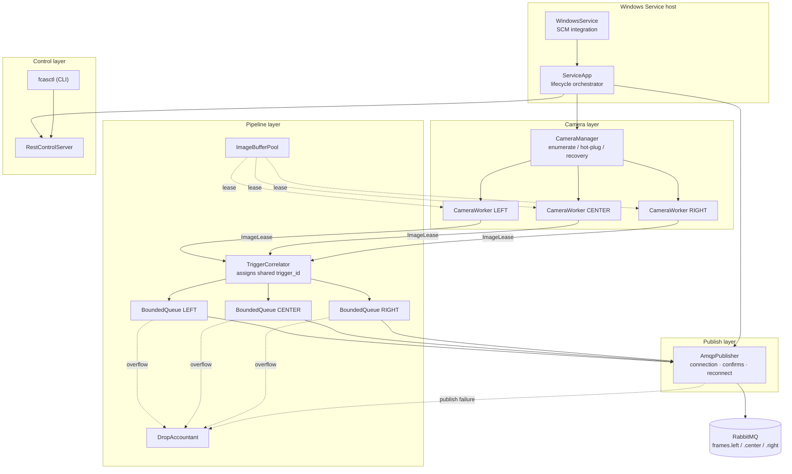
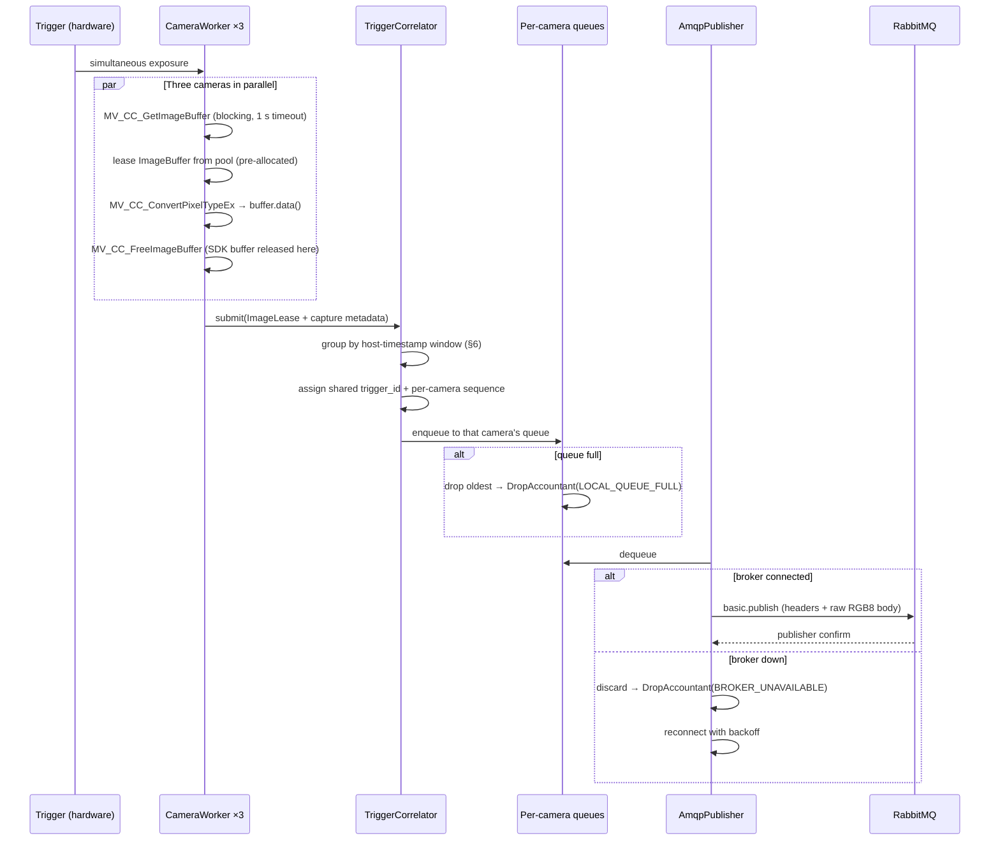
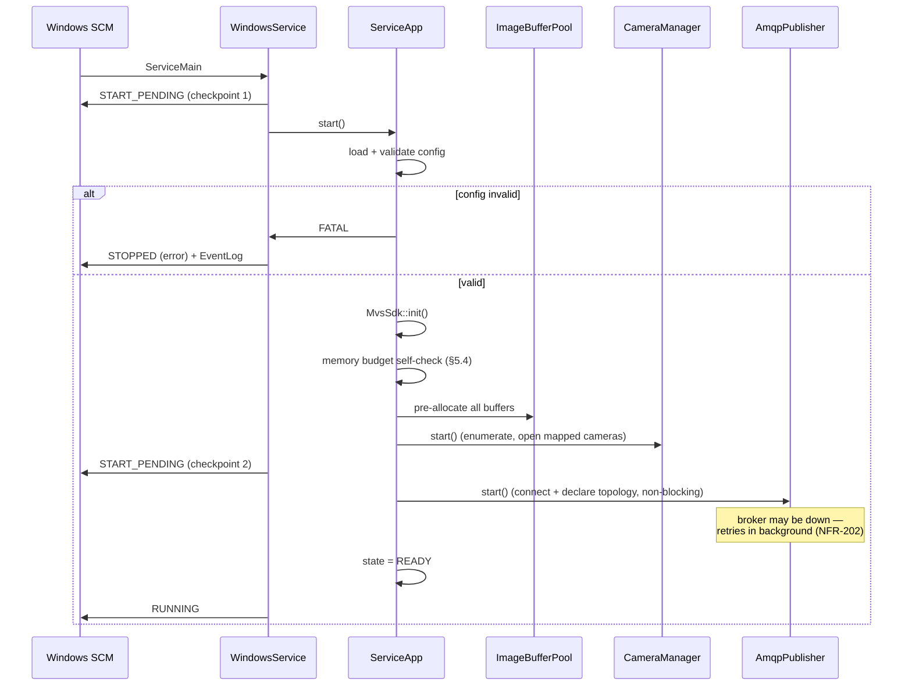
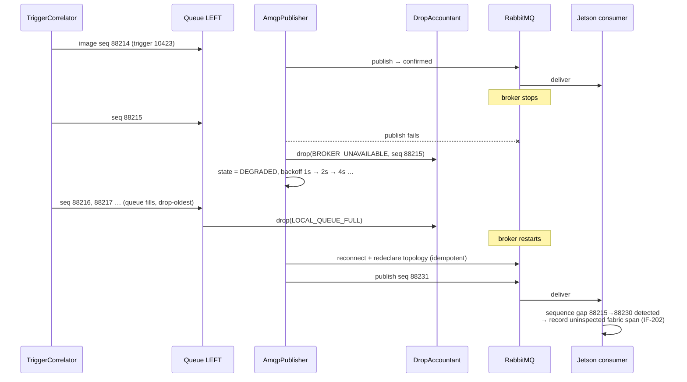

# Software Design Description
## Fabric Inspection — Camera Acquisition & Publishing Service (FCAS)

| Field | Value |
|---|---|
| Document | SDD — Camera Acquisition Service |
| Version | **2.0** (transport changed to RabbitMQ) |
| Implements | `SRS-camera-acquisition-service.md` v2.0 |
| Target | Hikrobot MV-VC3501X-128G60, Windows / Windows IoT, x64 |
| Language / toolchain | C++17, MSVC (v143+), CMake + vcpkg |
| Key dependencies | Hikrobot MVS SDK (Windows C API), **rabbitmq-c** (AMQP 0-9-1), an embedded HTTP server (e.g. cpp-httplib), nlohmann/json, spdlog |

### Revision history

| Ver | Change |
|---|---|
| 1.0 | Initial issue; gRPC streaming, protobuf Frame Sets, per-consumer sessions |
| **2.0** | **RabbitMQ transport.** Protobuf removed; pooled raw `ImageBuffer` replaces protobuf `Frame`; `FrameSetAssembler` → `TriggerCorrelator` (assigns shared ID, publishes per camera); `GrpcServer`/`ConsumerSession` → `AmqpPublisher` + `RestControlServer`; drop accounting split between local and broker-side |

---

## 1. Purpose and scope

This document specifies **how** the FCAS requirements are realised: component decomposition,
threading model, memory and buffer ownership, trigger correlation, AMQP publishing, error
handling, and the concrete source structure for implementation.

It is the last document before code. Every design element traces to an SRS requirement (§13).

---

## 2. Design drivers

| Driver | Consequence |
|---|---|
| **Acquisition must never block on broker or network I/O** (FR-508) | Hard decoupling between capture and publish via bounded per-camera queues; broker runs locally so publish is a loopback operation |
| **24/7 with bounded memory** (NFR-105, NFR-201) | Buffer pool pre-allocated at startup — **zero** large allocations in steady state; every queue bounded |
| **Three cameras form one logical slice, but publish separately** (FR-304/305) | A correlator assigns one shared `trigger_id` before fan-out to three queues (§6) |
| **Best-effort with an audit trail** (FR-503, FR-506) | Two distinct drop points — local (FCAS knows) and broker-side (consumer detects via sequence gaps) — both accounted (§7.8) |
| **Partial failure must degrade, not stop** (FR-106, NFR-206, NFR-208) | Per-camera thread isolation; broker loss yields `DEGRADED`, never halts acquisition |

---

## 3. Architectural overview



**Layer rule:** dependencies point downward only. The camera layer knows nothing about AMQP;
the publish layer knows nothing about the MVS SDK. The currency crossing the pipeline is a
pooled `ImageBuffer` plus a plain metadata struct.

---

## 4. Threading model

| # | Thread | Count | Responsibility | Blocking behaviour |
|---|---|---|---|---|
| T1 | **Service control** | 1 | SCM handler, start/stop dispatch | Event-driven |
| T2 | **CameraWorker** | 1 **per camera** (3) | `MV_CC_GetImageBuffer` → debayer → hand off | Blocks on SDK, 1 s timeout |
| T3 | **TriggerCorrelator** | 1 | Group frames into trigger events, assign shared `trigger_id`, fan out to per-camera queues | Condition variable, timed wait |
| T4 | **CameraMonitor** | 1 | Poll enumeration, detect hot-plug, drive the camera connection recovery loop | Sleeps on interval (3 s) |
| T5 | **AmqpPublisher** | 1 | Drain the three queues, publish to broker, handle confirms and reconnect | Blocks on AMQP socket write |
| T6 | **RestControlServer** | small pool | Serve UI/CLI control and status requests | HTTP-managed |
| T7 | **HealthMonitor** | 1 | Aggregate metrics, watchdog checks, publish telemetry | Sleeps on interval (1 s) |

### 4.1 Why one thread per camera
`MV_CC_GetImageBuffer` is a per-handle blocking call. One thread per camera gives fault
isolation (a hung camera blocks only its own thread — FR-106, NFR-206), parallel debayering
across cores, and matches the validated `MvCamApp` pattern. The SDK callback API is deliberately
not used: callbacks fire on SDK-owned threads with implicit lifetime rules, which complicates
buffer recycling for no gain at ~1 message/s.

### 4.2 Why a single publisher thread
`rabbitmq-c` connections are **not thread-safe**. A single publisher thread owning one connection
avoids all locking around the AMQP client, and is comfortably sufficient: three 15 MB publishes
per trigger over loopback take on the order of 150 ms, against a 2 800 ms trigger interval
(≈5% duty). At the NFR-103 stress rate of 2 triggers/s it is still ~30% duty.

*If per-camera publish isolation is ever required, the design extends to one publisher thread and
one connection per camera without touching any other component — the per-camera queues are
already the seam.*

### 4.3 Thread interaction



### 4.4 Synchronisation inventory

| Shared state | Protection | Notes |
|---|---|---|
| `ImageBufferPool` free-list | `std::mutex` | Held only for pointer pop/push — never during debayer or I/O |
| Correlator pending group | `std::mutex` + `std::condition_variable` | Owned solely by T3; workers only push to its inbox |
| Per-camera publish queues | `std::mutex` + condvar, bounded | Independent per camera — one camera's backlog cannot affect another |
| Camera registry | `std::shared_mutex` | Read-heavy (status), write-rare (hot-plug) |
| AMQP connection | **None** — thread-confined to T5 | The reason for a single publisher thread |
| Metrics / drop counters | `std::atomic` | Lock-free on the hot path |

**Lock discipline:** no lock is ever held across a blocking SDK call, a debayer operation, or an
AMQP publish. Hold times are bounded to pointer manipulation and counter updates.

---

## 5. Memory and buffer ownership

### 5.1 Pre-allocated pool — zero steady-state allocation

Allocating and freeing 15 MB blocks continuously for months invites heap fragmentation
(NFR-105). The pool allocates **every buffer once, at startup**, and never resizes thereafter:

```cpp
class ImageBuffer {                    // fixed capacity, never reallocated
public:
    uint8_t*       data()       { return buf_.data(); }
    size_t         capacity() const { return buf_.size(); }
private:
    std::vector<uint8_t> buf_;         // sized to frame_bytes at construction
};

class ImageBufferPool {                // thread-safe
public:
    ImageBufferPool(size_t count, size_t frameBytes);  // allocates all up front
    ImageLease acquire();              // blocks briefly, or returns empty on exhaustion
    void       release(ImageBuffer*);
};
```

`ImageLease` is a move-only RAII handle returning the buffer to the pool on destruction, so an
early return or an exception in a worker cannot leak a 15 MB block.

**Consequence:** after startup, FCAS performs **no large heap allocations at all**. This is the
mechanism by which NFR-105 (<5% growth over 7 days) is achieved rather than hoped for.

### 5.2 The copy path

```
MVS SDK buffer --MV_CC_ConvertPixelTypeEx--> pooled ImageBuffer --amqp_basic_publish--> socket
   (SDK owns,                (debayer writes                 (rabbitmq-c reads
    freed immediately)        directly into pool)             the pointer; no copy
                                                              on our side)
```

The MVS buffer is released with `MV_CC_FreeImageBuffer` in the same scope it was acquired,
guarded by RAII, so SDK buffers are held for the minimum possible time.

`amqp_basic_publish` takes an `amqp_bytes_t {len, bytes}` pointing at the pooled buffer; the
library streams it to the socket. The buffer is returned to the pool once the publish call
returns (or the message is dropped).

### 5.3 Ownership transitions

| Stage | Owner | Transfer |
|---|---|---|
| Raw capture | MVS SDK | `MV_CC_GetImageBuffer` / `MV_CC_FreeImageBuffer`, RAII-guarded |
| Debayered image | `ImageBufferPool` (leased) | `ImageLease` move |
| Correlation | `TriggerCorrelator` | `ImageLease` move into the target camera queue |
| Queued | Per-camera `BoundedQueue` | Move; on overflow the oldest lease is destroyed → buffer returns to pool |
| Publishing | `AmqpPublisher` (T5) | Move; lease destroyed after publish or discard |

Because a message is published to exactly one queue and consumed by exactly one publisher
thread, no reference counting is required — plain move semantics suffice.

### 5.4 Memory budget

```
frame_bytes  = width × height × 3 = 2448 × 2048 × 3 ≈ 15.04 MB

FCAS   ≈ frame_bytes × (pool_size)
       where pool_size ≥ Σ(queue_depth) + in-flight workers + publisher + margin

Broker ≈ frame_bytes × x-max-length × camera_count   (+ Erlang VM overhead)
```

| Component | Default configuration | Approx. RSS |
|---|---|---|
| FCAS buffer pool | 3 queues × depth 4 + 3 workers + 1 publisher + 2 margin = **18 buffers** | **≈ 271 MB** |
| FCAS other (code, logs, HTTP, metrics) | — | ≈ 50 MB |
| RabbitMQ queues | 3 queues × `x-max-length` 3 × 15.04 MB | **≈ 135 MB** |
| Erlang VM overhead | — | ≈ 80–120 MB |
| **Combined worst case** | | **≈ 550–580 MB** |

Constrained profile (queue depth 2, `x-max-length` 2, pool 12): **≈ 370 MB combined**.

> ⚠️ **Verification required (SRS §8 item 1).** Co-locating the broker means FCAS **and**
> RabbitMQ **and** the Erlang VM share the vision box's RAM. If the box has ≤ 2 GB usable, adopt
> the constrained profile. FCAS computes its own budget at startup, logs it, and **refuses to
> start** if it exceeds a configured `maxMemoryBudgetMB`. Broker memory is bounded independently
> by `x-max-length` and `vm_memory_high_watermark` (OP-108).

---

## 6. Trigger correlation — assigning a shared `trigger_id`

**The problem.** Hardware trigger fires all three cameras simultaneously, but each camera
delivers frames independently with only a *camera-local* frame counter. The SDK provides no
shared trigger identifier. FR-304 requires one, because with per-camera queues the consumer's
**only** means of reassembling a cross-web slice is `trigger_id` (ASM-007).

**Rejected: frame-counter correlation.** Assuming `frameNum == N` identifies the same trigger on
every camera is fragile — one missed trigger, a late start, or a reconnect desynchronises the
mapping permanently, silently, and unrecoverably. Downstream, defect positions would quietly
shift across the web.

**Adopted: host-timestamp windowing, validated by frame counters.**

The trigger interval (~2 800 ms) is three orders of magnitude larger than inter-camera trigger
jitter (< 1 ms with hardware fan-out) plus USB transfer skew (a few ms). Grouping is therefore
unambiguous with enormous margin.

```
groupingWindowMs = 200    (default; ≈7% of trigger interval, ≫ observed skew)
```

**Algorithm (runs on T3):**

```
on image arrival (image i, host timestamp t):
    if no open group:
        open group; trigger_id = ++triggerCounter; groupStart = t
    else if (t − groupStart) > groupingWindowMs:
        close group          # publish whatever it held; absent cameras are simply not published
        open group; trigger_id = ++triggerCounter; groupStart = t
    else if group already holds this camera position:
        close group          # defensive: never merge two distinct shots
        open group; trigger_id = ++triggerCounter; groupStart = t

    stamp i with trigger_id, per-camera ++sequence[position], position_mm, roll_id
    enqueue i to queue[position]                       # published immediately, not held

    if group now holds all expected cameras:
        close group                                     # fast path
```

**Key difference from v1.0.** Under gRPC the assembler *buffered* frames until the set was
complete. With per-camera queues there is no reason to hold anything: each image is stamped and
enqueued **immediately**. The group exists solely to allocate a consistent `trigger_id`. This
reduces latency and removes the partial-set timeout entirely — a missing camera simply produces
no message on its queue for that `trigger_id`, which the consumer detects during its own
grouping (IF-201).

**Independent validation.** Each `CameraWorker` tracks its camera's `nFrameNum` delta. A delta
≠ 1 means that camera missed a trigger; this is logged, counted per camera, and surfaced in
status. It is a *diagnostic only* — never an input to grouping — so a counter anomaly can never
corrupt correlation.

**Bound.** At most one group is open at a time, and it is force-closed after
`groupingWindowMs`, so correlator memory is O(1).

---

## 7. Component design

### 7.1 `MvsSdk` — RAII SDK lifetime
Wraps `MV_CC_Initialize` / `MV_CC_Finalize` as a process-scoped singleton with an explicit
`init()` returning a status. Guarantees `Finalize` runs exactly once at shutdown, even on the
error path.

### 7.2 `CameraDevice` — one physical camera
Owns a `void* handle`. Responsibilities: open/close, apply `CameraSettings`, configure trigger
nodes, start/stop grabbing, single-frame retrieval, parameter get/set with range validation
(FR-205), and the exposure-ceiling check (FR-206).

```cpp
class ICameraDevice {                              // interface enables mocking (§12)
public:
    virtual Status open(const MV_CC_DEVICE_INFO&)                 = 0;
    virtual Status applySettings(const CameraSettings&)           = 0;
    virtual Status configureTrigger(const TriggerConfig&)         = 0;
    virtual Status startGrabbing()                                = 0;
    virtual Status stopGrabbing()                                 = 0;
    virtual Status getFrame(MV_FRAME_OUT&, uint32_t timeoutMs)    = 0;
    virtual void   releaseFrame(MV_FRAME_OUT&)                    = 0;
    virtual Status close()                                        = 0;
};
```
Handles are held in `std::unique_ptr` with a custom deleter calling `MV_CC_CloseDevice` +
`MV_CC_DestroyHandle`, so no path can leak a handle.

### 7.3 `CameraWorker` — per-camera acquisition thread

```
loop while running:
    status = device.getFrame(mvsFrame, 1000ms)
    if timeout:  continue                        # normal when the line is idle
    if error:    record, signal CameraManager, backoff, continue

    ScopedMvsFrame guard(device, mvsFrame)       # RAII: guarantees FreeImageBuffer
    lease = pool.acquire()
    if !lease: dropAccountant.record(POOL_EXHAUSTED); continue
    convertBayerToRgb8(mvsFrame, lease.data())   # writes straight into the pooled buffer
    # guard releases the SDK buffer here — minimum hold time
    checkFrameCounterContinuity(mvsFrame.stFrameInfo.nFrameNum)
    correlator.submit(std::move(lease), captureMeta)
```

### 7.4 `CameraManager` — discovery, identity, hot-plug, recovery
- Startup and periodic enumeration (`MV_CC_EnumDevices`, 3 s poll — FR-102)
- Serial → `CameraPosition` mapping from config; **never** port order (FR-103)
- Unmapped serials → logged, reported `UNMAPPED`, excluded (FR-105)
- Spawns/joins a `CameraWorker` per connected mapped camera (FR-104)
- Implements the **camera connection recovery loop** of the team's architecture diagram:
  exponential backoff 1 s → 30 s cap, indefinite (FR-107)
- Owns the aggregate camera state driving `RUNNING` ⇄ `DEGRADED` ⇄ `FAULT`

Polling is the primary hot-plug mechanism (robust, SDK-agnostic).
`RegisterDeviceNotification` with `DEVICE_NOTIFY_SERVICE_HANDLE` is an optional latency
optimisation, not a correctness dependency.

### 7.5 `TriggerCorrelator`
Implements §6. Its inbox is small and monitored (workers must never block); it holds at most one
open group. Stamps each image with `trigger_id`, per-camera `sequence`, `position_mm`, and
`roll_id`, then enqueues to the matching per-camera `BoundedQueue`.

### 7.6 `BoundedQueue<T>` — the local drop point
Fixed capacity, drop-**oldest** on overflow (FR-509), reporting each drop to `DropAccountant`.
One instance per camera, so a stalled publish for one camera cannot affect the others.

### 7.7 `AmqpPublisher` — broker connection and publishing (T5)

Responsibilities:
- Own the single `amqp_connection_state_t`; thread-confined, no locking
- **Idempotent topology declaration at connect** (OP-107): declare the topic exchange, declare
  each camera queue with `x-max-length` / `x-overflow=drop-head` / `x-message-ttl`, bind
  routing keys
- Round-robin drain of the three per-camera queues
- Build AMQP headers per §5.1 of the SRS; body points at the pooled buffer (no copy)
- `delivery_mode = 1` (transient — CON-009)
- Publisher confirms in use; an unconfirmed publish counts as a drop (FR-511)
- Detect disconnection (socket error, missed heartbeat) → mark broker down, discard with reason
  `BROKER_UNAVAILABLE`, reconnect with exponential backoff 1 s → 30 s (FR-507)

**Connection tuning:**

| Setting | Value | Reason |
|---|---|---|
| `frame_max` | 1 MB | Reduces framing overhead for 15 MB bodies (default 128 KB would chunk each image ~118 times) |
| `heartbeat` | 10 s | Detects a dead broker promptly (FR-507) |
| `channel_max` | 4 | One channel per camera plus telemetry |

> **Queue declaration conflicts.** If a queue already exists with different arguments, RabbitMQ
> raises `PRECONDITION_FAILED` and closes the channel. `AmqpPublisher` SHALL catch this,
> log it explicitly with both argument sets, and enter `DEGRADED` rather than crash-looping —
> this is the most likely failure during a configuration change and must be diagnosable at a
> glance.

### 7.8 `DropAccountant` — two-tier loss accounting

Loss occurs at two distinct points, and only one of them is visible to FCAS:

| Where | Cause | Who detects it | Mechanism |
|---|---|---|---|
| **Local** (inside FCAS) | Broker down, local queue full, pool exhausted, camera missing | **FCAS** | `DropAccountant` counters, logs, telemetry (FR-510) |
| **Broker** (`drop-head` / TTL) | Consumer too slow or stopped | **Consumer** | `sequence` header discontinuity (FR-506, IF-202) |

This is the principal behavioural difference from v1.0: with a broker in the path, FCAS cannot
observe messages that RabbitMQ discards after accepting them. The **per-camera monotonic
`sequence` header** is what preserves the coverage audit trail — the consumer sees
`… 88213, 88214, 88217 …` and records the corresponding fabric span as uninspected.

*Optional extension (not in the default design):* a dead-letter exchange can route discarded
messages to a gap queue for sender-side visibility. This is deliberately **not** enabled by
default because dead-lettering 15 MB bodies doubles broker memory pressure for information the
sequence numbers already provide.

### 7.9 `RestControlServer` + `fcasctl`
Embedded HTTP server implementing SRS §5.3. Handlers are thin: validate → delegate to
`ServiceApp` / `CameraManager` → return a JSON result. No business logic in the transport layer.
Binds to the management interface only by default (FR-605, NFR-404).

`fcasctl` is a small CLI wrapping the same REST endpoints, giving operators and commissioning
engineers a scriptable interface (FR-602).

### 7.10 `WindowsService` / `ServiceApp`
`WindowsService` owns SCM integration: `ServiceMain`, `RegisterServiceCtrlHandlerEx`,
`SERVICE_START_PENDING` checkpoints during initialisation, graceful stop within 10 s (OP-104),
Windows Event Log source (FR-703).

`ServiceApp` is the platform-independent orchestrator: config load → SDK init → memory budget
check → pool allocation → camera manager → correlator → publisher → REST server → health
monitor, with reverse-order teardown. **The same `ServiceApp` runs in console mode**
(`--console`), so the service wrapper is never in the development loop.

Startup must tolerate the broker not yet being up (NFR-202): `AmqpPublisher` starts in the
disconnected state and retries in the background; acquisition proceeds regardless.

### 7.11 `HealthMonitor`
Detects a stalled acquisition loop: state `RUNNING` but no trigger processed within
`watchdogTimeoutMs` (default 10× expected trigger interval). Escalation: log → `DEGRADED` →
force camera reconnect → `FAULT` (NFR-205). Also samples camera temperature, queue depths, drop
counters, and broker connection state, and publishes the telemetry JSON (FR-512).

---

## 8. State machine implementation

The SRS §6.1 state machine is an explicit `ServiceState` enum owned by `ServiceApp`, with
transitions driven only by `CameraManager` aggregate state, `AmqpPublisher` connection state, and
control requests. Every transition is logged with old state, new state, and cause.

| Condition | State |
|---|---|
| All mapped cameras connected, broker connected, acquisition active | `RUNNING` |
| ≥1 (not all) cameras connected, **or** broker unreachable, acquisition active | `DEGRADED` |
| Zero mapped cameras connected | `FAULT` |
| Cameras ready, acquisition stopped | `READY` |
| Config invalid / SDK init failed / memory budget exceeded | `FAULT` (terminal until reconfigured) |

`DEGRADED` is deliberately not a stop condition: two of three cameras still inspect two thirds of
the web, and a broker outage must never halt capture (NFR-208).

---

## 9. Error taxonomy

| Domain | Prefix | Severity | Recovery |
|---|---|---|---|
| Configuration | `E_CFG_*` | FATAL | None — refuse to start (FR-210) |
| SDK / device | `E_CAM_*` | ERROR | Reconnect with backoff |
| Acquisition | `E_ACQ_*` | WARN | Continue; count and report |
| Correlation | `E_COR_*` | WARN | Close group, continue |
| Broker / publish | `E_MQ_*` | WARN/ERROR | Discard + reconnect with backoff |
| Service | `E_SVC_*` | ERROR/FATAL | Watchdog restart or SCM recovery |

```cpp
struct Status {
    ErrorCode   code   = ErrorCode::Ok;
    int32_t     sdkRet = 0;         // raw MVS hex code, preserved for diagnosis
    int32_t     amqpRet = 0;        // raw AMQP/library status, preserved
    std::string message;
    bool ok() const { return code == ErrorCode::Ok; }
};
```

**Rule:** raw SDK and AMQP return codes are never discarded — every wrapped error carries the
original value so field diagnosis can reference vendor documentation directly.

**Exception policy:** exceptions are permitted internally but **never** cross a thread entry
point or an HTTP handler. Each thread body is wrapped in a top-level `try/catch` that logs, marks
the component faulted, and returns cleanly — an uncaught exception can never terminate the
service (NFR-203).

---

## 10. Source structure

```
FabricCameraService/
├── CMakeLists.txt
├── vcpkg.json                          # rabbitmq-c, nlohmann-json, spdlog, httplib, gtest
├── config/
│   └── fcas.config.json
├── docs/
│   ├── SRS-camera-acquisition-service.md
│   ├── SDD-camera-acquisition-service.md
│   └── integration-guide.md            # message contract + Python consumer example
├── src/
│   ├── main.cpp                        # service vs --console dispatch
│   ├── service/   WindowsService.{h,cpp}   ServiceApp.{h,cpp}
│   ├── config/    Config.{h,cpp}           ConfigValidator.{h,cpp}
│   ├── camera/    MvsSdk.{h,cpp}           CameraDevice.{h,cpp}
│   │              ICameraDevice.h          CameraWorker.{h,cpp}
│   │              CameraManager.{h,cpp}    PixelConverter.{h,cpp}
│   │              ScopedMvsFrame.h
│   ├── pipeline/  TriggerCorrelator.{h,cpp}  ImageBufferPool.{h,cpp}
│   │              BoundedQueue.h             DropAccountant.{h,cpp}
│   ├── publish/   AmqpPublisher.{h,cpp}      AmqpConnection.{h,cpp}
│   │              MessageBuilder.{h,cpp}     # headers per SRS §5.1
│   ├── control/   RestControlServer.{h,cpp}  ApiHandlers.{h,cpp}
│   ├── telemetry/ Metrics.{h,cpp}  HealthMonitor.{h,cpp}  Logger.{h,cpp}
│   └── common/    Error.h  Types.h  Version.h
├── tools/         fcasctl/                  # CLI
└── tests/         unit/  integration/  mocks/
```

---

## 11. Key sequences

### 11.1 Startup



### 11.2 Broker outage and recovery



---

## 12. Test design

| Level | Scope | Mechanism |
|---|---|---|
| **Unit** | `BoundedQueue` drop semantics, `ImageBufferPool` exhaustion/reuse, `TriggerCorrelator` grouping and ID assignment, `Config` validation, `MessageBuilder` header correctness, `DropAccountant` | GoogleTest; no hardware, no broker |
| **Component** | `CameraManager` hot-plug/recovery state machine | `MockCameraDevice` behind `ICameraDevice` — full CI without cameras |
| **Broker integration** | Topology declaration, `drop-head` behaviour, TTL expiry, reconnect, confirms | Local RabbitMQ in Docker/service; induced outages |
| **End-to-end** | Real cameras → broker → test consumer; `trigger_id` correlation across three queues | Software trigger + Python test consumer |
| **Soak** | AC-05 (24 h), AC-08 (7 day memory) | Long-run harness with RSS sampling for FCAS **and** broker |
| **Fault injection** | Camera unplug, broker stop, network drop, consumer stop, config corruption, queue-argument conflict | Scripted; asserts state transitions and drop accounting |
| **Performance** | AC-07 latency p99, AC-09 at 2 triggers/s | Instrumented timestamps at each stage boundary |

**Design-for-test decision:** `ICameraDevice` lets the entire pipeline run against mocks, keeping
CI hardware-free and making correlator edge cases (missing camera, late frame, duplicate
position, counter gap) directly testable — exactly the cases that are near-impossible to
reproduce on a running line.

---

## 13. Requirements traceability

| SRS req | Design element |
|---|---|
| FR-101…108 | `CameraManager` (§7.4), `CameraDevice` (§7.2) |
| FR-103 | Serial→position map; AC-03 port-shuffle test |
| FR-107 | Camera connection recovery loop (§7.4) |
| FR-201…211 | `Config`, `ConfigValidator`; startup gate §11.1 |
| FR-206 | `CameraDevice::applySettings` exposure-ceiling check |
| FR-301…303 | `CameraDevice::configureTrigger`; REST `trigger` endpoint |
| FR-304…307 | `TriggerCorrelator` (§6, §7.5) |
| FR-308/309 | Position accumulator in correlator; REST `roll` endpoint |
| FR-310 | Per-camera `sequence` assignment (§6) |
| FR-401…404 | `PixelConverter`, copy path §5.2 |
| FR-501/502 | `AmqpPublisher` topology declaration (§7.7) |
| FR-503/504 | Queue arguments `x-max-length`, `x-overflow`, `x-message-ttl` (§7.7) |
| FR-505 | `delivery_mode = 1` (§7.7) |
| FR-506 | Sequence header + consumer-side detection (§7.8) |
| FR-507 | Reconnect backoff (§7.7), sequence §11.2 |
| FR-508/509 | Per-camera `BoundedQueue` decoupling (§7.6); local broker (SRS §2.5) |
| FR-510/511 | `DropAccountant` (§7.8); publisher confirms |
| FR-512 | `HealthMonitor` telemetry publish (§7.11) |
| FR-601…605 | `RestControlServer`, `fcasctl` (§7.9) |
| FR-701…705 | `Metrics`, `HealthMonitor`, `Logger` (§7.11) |
| NFR-101/102 | Immediate enqueue on stamp — no set buffering (§6) |
| NFR-105 | Pre-allocated `ImageBufferPool`, zero steady-state allocation (§5.1) |
| NFR-106 | Broker budget §5.4; `x-max-length`; OP-108 watermark |
| NFR-202 | Publisher starts disconnected, retries in background (§7.10) |
| NFR-203 | Per-thread top-level exception guards (§9) |
| NFR-205 | `HealthMonitor` watchdog (§7.11) |
| NFR-206/208 | Per-camera thread isolation (§4.1); `DEGRADED` on broker loss (§8) |
| OP-101…108 | `WindowsService` (§7.10); idempotent declaration (§7.7) |

---

## 14. Design-level open items

| # | Item | Impacts |
|---|---|---|
| 1 | **Vision box RAM** — must host FCAS + RabbitMQ + Erlang (§5.4) | Default vs constrained profile |
| 2 | **USB3 controller topology** — 3 cameras sharing bandwidth/power on one root hub | `CameraWorker` concurrency; may require staggered start |
| 3 | **RabbitMQ + Erlang on Windows IoT** — confirm installability and service registration on the box | ASM-006, OP-108 |
| 4 | **rabbitmq-c build under MSVC** via vcpkg; confirm no runtime conflict with the MVS SDK | Build system (§10) |
| 5 | **Observed inter-camera skew** — measure on real hardware to confirm the 200 ms grouping window | §6 tuning |
| 6 | **Trigger pitch** — roller circumference vs required ~460 mm | Position accumulator accuracy (FR-308) |
| 7 | **`x-message-ttl` value** — derive from camera-to-marking-station distance | FR-504 |

---

## 15. Implementation sequence

| Step | Deliverable | Verifiable by |
|---|---|---|
| 1 | Skeleton + config + logging + console mode | Starts, loads config, logs, exits cleanly |
| 2 | `MvsSdk`, `CameraDevice`, single-camera capture | One camera captures in console mode |
| 3 | `ImageBufferPool`, `PixelConverter`, zero-alloc debayer | RGB8 verified against a saved reference image |
| 4 | `CameraWorker` + `CameraManager` + hot-plug/recovery | AC-02, AC-03 |
| 5 | `TriggerCorrelator` + `BoundedQueue` + `DropAccountant` | Unit tests incl. all grouping and drop cases |
| 6 | `AmqpPublisher` + topology + confirms + reconnect | AC-06, AC-13 against a local broker |
| 7 | `RestControlServer` + `fcasctl` | AC-15 |
| 8 | `WindowsService` + Event Log + recovery config | AC-01 reboot test |
| 9 | `HealthMonitor` + metrics + telemetry | AC-12, watchdog fault injection |
| 10 | Message contract delivery + Python example consumer | AC-10, AC-14 |
| 11 | Hardware trigger integration + position accumulator | AC-04, AC-11 |
| 12 | Soak + performance validation | AC-05, AC-07, AC-08, AC-09 |

Steps 1–3 need one camera. Steps 4–7 and 10 can proceed against mocks and a local broker.
Step 11 requires the trigger hardware and the running line.
