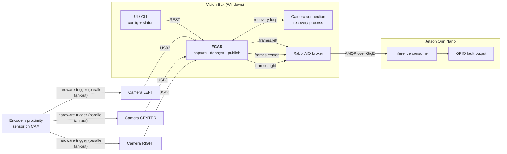
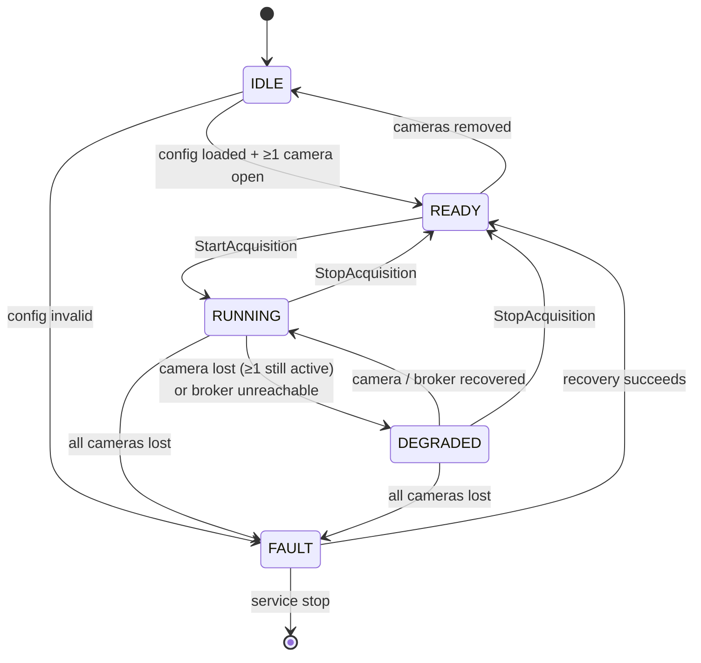

# Software Requirements Specification
## Fabric Inspection — Camera Acquisition & Publishing Service (FCAS)

| Field | Value |
|---|---|
| Document | SRS — Camera Acquisition Service |
| Version | **3.0** (implementation language changed to Python) |
| Status | Pending team sign-off |
| Target platform | Hikrobot MV-VC3501X-128G60 vision box, Windows / Windows IoT |
| Implementation language | **Python 3.12 (CPython, 64-bit)** |
| Module owner | Camera subsystem |
| Primary consumer | Inference service on NVIDIA Jetson Orin Nano Super |

### Revision history

| Ver | Change | Reason |
|---|---|---|
| 1.0 | Initial issue; gRPC streaming transport | — |
| 2.0 | **Transport changed to RabbitMQ (AMQP 0-9-1).** Per-camera queues; broker-side queue limiting; control plane moved to REST + CLI; Frame Set bundling replaced by per-camera publish with shared correlation ID | AI team standardised on RabbitMQ |
| **3.0** | **Implementation language changed from C++17 to Python 3.12.** Camera access moves to the MVS Python SDK (ctypes); AMQP client becomes `pika`; REST server becomes Flask + waitress; Windows Service hosting becomes `pywin32`. **No functional requirement, message header, queue argument, topology name, state name, or acceptance criterion changes.** Additions are confined to CON-003, CON-011, ASM-008, ASM-009, NFR-305, NFR-306, OP-109 and open items 10–12 | Team decision — Python is the team's working language and matches the consumer side, shortening the path to a maintainable, debuggable service |

> **Contract stability.** §5.1 (message contract), §5.3 (REST API) and §6.1 (state machine) are
> byte-for-byte identical to v2.0. The Jetson consumer is unaffected by the language change and
> requires no rework. This is a deliberate constraint on the port, not a coincidence.

---

## 1. Introduction

### 1.1 Purpose
This document specifies the requirements for the **Fabric Camera Acquisition Service (FCAS)** — a
Windows service running unattended on the vision box that controls three area-scan cameras,
captures synchronised images of running fabric on hardware trigger, and publishes those images
with identifying metadata to a RabbitMQ broker for consumption by the inference service.

### 1.2 Scope

**In scope:**
- Discovery, configuration, and lifecycle management of USB3 Hikrobot cameras
- Hardware-triggered and software-triggered image capture
- Bayer→RGB8 conversion on the vision box
- Publishing images + metadata to RabbitMQ, one queue per camera
- Camera configuration via UI/CLI
- Camera connection recovery on disconnect
- Running 24/7 as an unattended Windows service with automatic recovery
- Logging, health reporting, and diagnostics

**Out of scope:**
- Defect detection / inference (Jetson)
- GPIO fault signalling (Jetson)
- Illumination hardware control
- Cloud upload (deferred; broker topology does not preclude it)
- Operation and administration of the RabbitMQ broker itself

### 1.3 Definitions

| Term | Meaning |
|---|---|
| **FCAS** | Fabric Camera Acquisition Service — the software specified here |
| **Trigger event** | A single hardware/software pulse causing all cameras to expose simultaneously |
| **`triggerId`** | Monotonic ID assigned by FCAS, **shared by all images from one trigger event** — the key by which the consumer reassembles a cross-web slice |
| **Logical camera ID** | Stable position identifier: `LEFT`, `CENTER`, `RIGHT` |
| **Consumer** | The inference service on the Jetson subscribing to the camera queues |
| **Broker** | The RabbitMQ server |
| **Gap** | A trigger event whose image did not reach the consumer |

### 1.4 Reference documents
- `SDD-camera-acquisition-service.md` — design realisation
- **Machine Vision Camera SDK Developer Guide (Windows, Python) V4.8.0** —
  `C:\Program Files (x86)\MVS\Development\Documentations\` — the authoritative Python API reference
- **MVS Python samples** — `C:\Program Files (x86)\MVS\Development\Samples\Python\` — the validated
  call sequences (`General\GrabImage`, `General\ConvertPixelType`, `AreaScanCamera\MultipleCameras`)
- **MVS Python binding source** — `…\Samples\Python\MvImport\` — `MvCameraControl_class.py`,
  `CameraParams_header.py`, `MvErrorDefine_const.py`, `PixelType_header.py`
- RabbitMQ AMQP 0-9-1 specification and queue-length-limit documentation
- `pika` documentation (AMQP 0-9-1 client), `pywin32` service framework documentation

---

## 2. Overall description

### 2.1 System context



### 2.2 Operating parameters (derived)

| Parameter | Value | Basis |
|---|---|---|
| Fabric width | 1778 mm (70″) | Given |
| Cameras | 3 × area-scan, USB3 | Given |
| Per-camera FOV | ~650 mm (incl. ~10% overlap) | 1778 / 3 + overlap |
| Optical resolution | ~0.265 mm/px | 2448 px / 650 mm |
| Smallest defect | 1.5 mm → **~5.7 px** | Meets 3–5 px criterion |
| Max line speed | 10 m/min = 166.7 mm/s | Given |
| Frame coverage along web | ~543 mm | 2048 px × 0.265 mm |
| **Trigger rate** | **~0.36 /s (≈1 per 2.8 s)** | 15% along-web overlap |
| Image size (RGB8) | 15.04 MB per camera | 2448×2048×3 |
| Message rate to broker | ~1.08 msg/s (3 cameras) | 3 × 0.36 |
| **Sustained data rate** | **~16.2 MB/s ≈ 130 Mbps** | ~14% of GigE |
| Consumer capacity (stated) | 6 FPS per camera | AI team |
| **Utilisation vs capacity** | **~6%** (0.36 of 6 FPS) | Large headroom — §2.6 |
| Camera→cabinet distance | 635 mm (25″) | Within USB3 passive limits |

### 2.3 Critical derived constraint

> **CON-001 — Exposure ceiling.** At 166.7 mm/s and 0.265 mm/px, fabric traverses one pixel in
> **1.59 ms**. To limit motion blur to ≤0.5 px, **exposure time must not exceed ~0.8 ms**.
> The system SHALL support and default to short exposure, and illumination MUST be specified to
> deliver adequate signal at that exposure. This is the binding optical constraint on the design.

### 2.4 Constraints

| ID | Constraint |
|---|---|
| CON-002 | Target OS is Windows / Windows IoT; FCAS runs as a Windows Service under Session 0 (no GUI, no desktop interaction) |
| CON-003 | Camera access via the **Hikrobot MVS Python SDK** (`MvImport`, a `ctypes` binding over `MvCameraControl.dll`). The binding is loaded from the MVS installation via `MVCAM_COMMON_RUNENV`; it is **not** vendored into this repository and is never modified |
| CON-004 | Cameras connect over USB3; all three share the vision box's USB controllers |
| CON-005 | Delivery model is **best-effort** — frames are discarded rather than allowed to accumulate |
| CON-006 | Wire format is **debayered RGB8**, produced on the vision box |
| CON-007 | Trigger is wired **directly to camera hardware trigger inputs**, in parallel to all cameras |
| **CON-008** | **Transport is RabbitMQ (AMQP 0-9-1), one queue per camera** — team decision |
| **CON-009** | **Messages are transient (non-persistent).** Persisting 16 MB/s of best-effort image data would consume disk write bandwidth and endurance for data that is intentionally discardable |
| **CON-010** | **The broker runs on the vision box** (see §2.5) so that publishing is a local operation and can never block acquisition on network I/O |
| **CON-011** | **Implementation language is Python 3.12 (CPython, 64-bit).** The service is hosted under the Windows SCM through `pywin32`. All third-party packages must be installable offline from a pinned wheelhouse, since the vision box has no assured internet access |

### 2.5 Broker placement rationale

FR-508 requires that acquisition never block on network I/O. If the broker were remote, every
publish would traverse the network and a network stall could back-pressure into the acquisition
path. With the broker **local to the vision box**:

- Publishing is a loopback socket operation — fast and not subject to network faults.
- A network or Jetson outage simply stops consumption; queues reach their length limit and
  discard oldest messages, which is precisely the intended best-effort behaviour.
- Failure handling collapses to a single, well-understood mechanism.

Broker host is nevertheless configurable (FR-521) so the deployment can be revisited.

### 2.6 Capacity headroom

The AI team's stated consumer capacity is 6 FPS per camera. The system produces **0.36 FPS per
camera** — about **6% of capacity**. Queue-limit flushing is therefore **not expected to occur in
normal operation**; it is a safety mechanism for abnormal conditions (consumer stopped, network
loss, inference stall) rather than a routine occurrence.

### 2.7 Assumptions

| ID | Assumption |
|---|---|
| ASM-001 | The trigger source produces one pulse per fixed fabric distance, matched to the required frame pitch (~460 mm) |
| ASM-002 | Vision box has sufficient USB3 bandwidth and port power for 3 cameras concurrently |
| ASM-003 | A dedicated GigE link (or reliable LAN segment) exists between vision box and Jetson |
| ASM-004 | Illumination is synchronised or continuous and adequate at ≤0.8 ms exposure |
| ASM-005 | The ML model is trained on RGB8 images equivalent to those produced by MVS debayering |
| **ASM-006** | **RabbitMQ (3.11+) plus the Erlang runtime can be installed and run on the vision box** within its RAM budget |
| **ASM-007** | **The consumer correlates the three per-camera streams by `trigger_id`** to reconstruct a full-width slice |
| **ASM-008** | **A 64-bit CPython 3.12 runtime and the pinned dependency set can be installed on the vision box** and started by the SCM under a service account. The MVS Python binding is present in the MVS installation and `MVCAM_COMMON_RUNENV` is set as a **machine-scope** environment variable, so a service account can resolve it |
| **ASM-009** | **The MVS `ctypes` binding releases the GIL for the duration of every SDK call** (it loads `MvCameraControl.dll` via `WinDLL`, which does). Per-camera acquisition threads therefore overlap genuinely rather than serialising — see SDD §4.5 |

---

## 3. Functional requirements

### 3.1 Camera discovery and identity

| ID | Requirement | Priority |
|---|---|---|
| FR-101 | FCAS SHALL enumerate connected Hikrobot USB3 cameras at startup using the MVS Python SDK (`MV_CC_EnumDevices`). | Must |
| FR-102 | FCAS SHALL continuously detect cameras connected or disconnected at runtime (hot-plug), by polling enumeration at a configurable interval (default 3 s) and/or Windows device notifications. | Must |
| FR-103 | FCAS SHALL identify each camera by its **serial number**, and map it to a **logical camera ID** (`LEFT`/`CENTER`/`RIGHT`) via configuration. USB port order SHALL NOT be used for identity. | Must |
| FR-104 | On detecting a camera whose serial is present in configuration, FCAS SHALL automatically open it, apply its configuration profile, and include it in acquisition without operator action. | Must |
| FR-105 | On detecting a camera whose serial is **not** in configuration, FCAS SHALL log a warning, report it in status as `UNMAPPED`, and SHALL NOT include it in acquisition. | Must |
| FR-106 | On camera disconnection, FCAS SHALL log the event, emit a status change, enter `DEGRADED` state, and continue operating with remaining cameras. | Must |
| FR-107 | FCAS SHALL run a **camera connection recovery process** that automatically attempts reconnection of lost cameras with exponential backoff (initial 1 s, max 30 s), indefinitely. | Must |
| FR-108 | FCAS SHALL expose the list of expected, connected, and missing cameras via the status interface. | Must |

### 3.2 Configuration

| ID | Requirement | Priority |
|---|---|---|
| FR-201 | FCAS SHALL read configuration from a human-readable JSON file at a fixed, documented path. | Must |
| FR-202 | Configuration SHALL support **global defaults** and **per-camera overrides** (cameras may require different exposure/white balance due to lighting non-uniformity across the web). | Must |
| FR-203 | FCAS SHALL support configuring, per camera: ROI (`width`, `height`, `offsetX`, `offsetY`), `exposureTimeUs`, `gainDb`, `pixelFormat` (source), white balance (auto/manual RGB), gamma, **contrast**, **USB transfer bandwidth settings**, and Bayer interpolation quality. | Must |
| FR-204 | FCAS SHALL support configuring trigger parameters per camera: trigger mode (on/off), trigger source (hardware line / software), trigger activation edge (rising/falling), trigger delay (µs), and debounce time. | Must |
| FR-205 | FCAS SHALL validate all configuration values against the camera's reported valid range before applying, and SHALL reject and log invalid values without crashing. | Must |
| FR-206 | FCAS SHALL apply an explicit `exposureTimeUs` ceiling (configurable, default 800 µs) and SHALL log a warning if a configured value exceeds it, per CON-001. | Must |
| FR-207 | FCAS SHALL support runtime reconfiguration of exposure, gain, contrast, and white balance **from the UI/CLI** without restarting the service. | Must |
| FR-208 | FCAS SHALL support named configuration **profiles** (e.g. per fabric type) selectable at runtime. | Should |
| FR-209 | FCAS SHALL provide a generic key/value parameter escape hatch mapping to GenICam nodes, for parameters not explicitly modelled. | Should |
| FR-210 | If the configuration file is missing or unparseable at startup, FCAS SHALL log a fatal error, report `FAULT`, and SHALL NOT capture — it MUST NOT start with silent defaults. | Must |
| FR-211 | FCAS SHALL support configuring **free-run frame rate (FPS)**, applicable only when trigger mode is free-run. In hardware-trigger mode the effective rate is determined by the trigger source and FPS SHALL be reported as derived, not configurable. | Must |

### 3.3 Triggering and acquisition

| ID | Requirement | Priority |
|---|---|---|
| FR-301 | FCAS SHALL configure all cameras for **hardware trigger** mode as the production default. | Must |
| FR-302 | FCAS SHALL support a **software trigger** mode for commissioning and testing, issuing a simultaneous software trigger to all active cameras. | Must |
| FR-303 | FCAS SHALL support a **free-run** mode with configurable frame rate, for bench testing and focus/lighting setup only. | Should |
| FR-304 | FCAS SHALL assign every trigger event a **monotonically increasing `trigger_id`**, and SHALL stamp that same value on the message published from **every** camera for that event. | Must |
| FR-305 | FCAS SHALL publish each camera's image as a **separate message to that camera's own queue** (CON-008). Correlation across cameras is performed by the consumer using `trigger_id` (ASM-007). | Must |
| FR-306 | FCAS SHALL correlate frames into trigger events using a configurable grouping window (default 200 ms), and SHALL NOT rely on camera-local frame counters for correlation. | Must |
| FR-307 | Where a camera fails to deliver an image for a trigger event, FCAS SHALL publish nothing for that camera and SHALL record a per-camera gap; the other cameras' messages for that `trigger_id` SHALL still be published. | Must |
| FR-308 | FCAS SHALL maintain a trigger counter and, where the trigger pitch is configured, SHALL compute and attach an estimated fabric **position (mm)** to each message. | Should |
| FR-309 | FCAS SHALL support resetting the trigger counter and position to zero on a **roll change** command. | Must |
| FR-310 | FCAS SHALL stamp each message with a **per-camera monotonic sequence number**, enabling the consumer to detect broker-side discards (FR-506). | Must |

### 3.4 Image processing

| ID | Requirement | Priority |
|---|---|---|
| FR-401 | FCAS SHALL convert each captured image from its native (Bayer) format to **RGB8** using the MVS SDK conversion API (`MV_CC_ConvertPixelTypeEx`). Conversion SHALL write directly into a pre-allocated pooled buffer; FCAS SHALL NOT allocate a destination buffer per frame. | Must |
| FR-402 | Bayer interpolation quality SHALL be configurable, defaulting to the balanced setting. | Should |
| FR-403 | FCAS SHALL NOT apply lossy compression to published images. | Must |
| FR-404 | FCAS SHALL perform no cropping, scaling, or enhancement beyond configured camera ROI, debayering, and configured contrast/gamma. | Must |

### 3.5 Publishing to RabbitMQ

| ID | Requirement | Priority |
|---|---|---|
| FR-501 | FCAS SHALL publish images to a RabbitMQ broker over AMQP 0-9-1. | Must |
| FR-502 | FCAS SHALL declare, at startup, one **durable queue per camera** (`frames.left`, `frames.center`, `frames.right`) bound to a topic exchange (§5.1). | Must |
| FR-503 | Each queue SHALL be declared with a **maximum length** (`x-max-length`, configurable, default 3 messages) and **`x-overflow = drop-head`**, so that when a queue exceeds the consumer's capacity the **oldest** message is discarded automatically. | Must |
| FR-504 | Each queue SHALL be declared with a **message TTL** (`x-message-ttl`, configurable, default 5000 ms) so that stale images — describing fabric that has already passed the marking station — are discarded rather than processed late. | Must |
| FR-505 | Messages SHALL be published as **transient** (`delivery_mode = 1`, non-persistent) per CON-009. | Must |
| FR-506 | Every message SHALL carry a **per-camera monotonic sequence number** and its `trigger_id`, so the consumer can detect discarded messages by sequence discontinuity and record the corresponding fabric region as uninspected. | Must |
| FR-507 | FCAS SHALL detect broker unavailability and SHALL automatically reconnect with exponential backoff (initial 1 s, max 30 s), indefinitely. | Must |
| FR-508 | **FCAS SHALL NOT block acquisition on broker or network I/O under any circumstance.** While the broker is unreachable, captured images SHALL be discarded at a bounded internal queue and counted. | Must |
| FR-509 | FCAS SHALL bound its internal publish queue (configurable, default 4 messages per camera) and SHALL discard the **oldest** on overflow. | Must |
| FR-510 | FCAS SHALL count and report all locally discarded messages, distinguishing the reason (`BROKER_UNAVAILABLE`, `LOCAL_QUEUE_FULL`, `CAMERA_MISSING`). | Must |
| FR-511 | FCAS SHALL use **publisher confirms** to detect publish failures, and SHALL treat an unconfirmed publish as a discard for accounting purposes. | Should |
| FR-512 | FCAS SHALL publish periodic **status/telemetry messages** as small JSON payloads to a separate telemetry exchange, for UI and monitoring consumption. | Should |
| FR-521 | Broker host, port, virtual host, credentials, exchange and queue names SHALL be configurable. | Must |

### 3.6 Control interface (UI / CLI)

| ID | Requirement | Priority |
|---|---|---|
| FR-601 | FCAS SHALL expose a local **HTTP REST API** (JSON) providing: list cameras, get/set camera configuration, start/stop acquisition, software trigger, set roll ID, get status, get health. | Must |
| FR-602 | FCAS SHALL provide a **CLI tool** wrapping the REST API for operator and commissioning use. | Must |
| FR-603 | All control operations SHALL return a structured result with a status code and human-readable message. | Must |
| FR-604 | Control operations SHALL be idempotent where semantically reasonable (e.g. starting an already-running acquisition returns success, not an error). | Should |
| FR-605 | The REST API SHALL bind to a configurable address, defaulting to the local/management interface only. | Must |

### 3.7 Health, logging, diagnostics

| ID | Requirement | Priority |
|---|---|---|
| FR-701 | FCAS SHALL maintain and expose: per-camera connected state, achieved trigger rate, total triggers, total messages published, total discarded (by reason), broker connection state, last error per camera, camera temperature (if available), uptime, and current state. | Must |
| FR-702 | FCAS SHALL write structured, timestamped logs to rotating files with configurable retention (default 30 days or 1 GB, whichever first). | Must |
| FR-703 | FCAS SHALL write service lifecycle events (start, stop, fault, camera loss/recovery, broker loss/recovery) to the **Windows Event Log**. | Must |
| FR-704 | Log level SHALL be configurable (`ERROR`/`WARN`/`INFO`/`DEBUG`) without recompilation. | Must |
| FR-705 | FCAS SHOULD provide a diagnostic mode that saves captured images to local disk for offline inspection (bounded by count/size, off by default). | Should |

---

## 4. Non-functional requirements

### 4.1 Performance

| ID | Requirement |
|---|---|
| NFR-101 | End-to-end latency from trigger pulse to message accepted by the broker SHALL be ≤ **300 ms** (p99). |
| NFR-102 | FCAS SHALL sustain the nominal trigger rate (0.36/s per camera) with **zero** local discards while the broker is reachable and the consumer is keeping up. |
| NFR-103 | FCAS SHALL support trigger rates up to **2/s per camera** without local loss, to accommodate future line-speed increases. |
| NFR-104 | Steady-state CPU utilisation by FCAS SHALL be ≤ 30% of the vision box's total capacity at nominal rate, **excluding** broker overhead. Measurement includes the Python interpreter itself. |
| NFR-105 | FCAS memory consumption SHALL be bounded and stable; growth over a 7-day continuous run SHALL be < 5%, measured from a **post-warm-up** baseline (the interpreter's allocator settles over the first minutes of operation). |
| NFR-106 | Broker memory attributable to camera queues SHALL be bounded by queue length limits; the computed worst case SHALL be documented and verified against available RAM. |

### 4.2 Reliability & availability

| ID | Requirement |
|---|---|
| NFR-201 | FCAS SHALL operate continuously **24/7** without scheduled restarts. |
| NFR-202 | FCAS SHALL start automatically on system boot, without operator login, and SHALL tolerate the broker not yet being available at that moment. |
| NFR-203 | FCAS SHALL recover automatically from: camera disconnect, broker disconnect, network loss, and unhandled worker-thread failure. |
| NFR-204 | The Windows Service SHALL be configured with automatic restart on failure. |
| NFR-205 | FCAS SHALL implement an internal watchdog that detects a stalled acquisition loop and self-recovers. |
| NFR-206 | No single camera failure SHALL prevent the remaining cameras from operating or publishing. |
| NFR-207 | FCAS SHALL survive vision box power loss and resume normal operation on reboot with no manual intervention. |
| NFR-208 | Broker unavailability SHALL NOT stop acquisition; FCAS SHALL continue capturing, discard locally, and resume publishing on reconnection. |

### 4.3 Maintainability & operability

| ID | Requirement |
|---|---|
| NFR-301 | All tunable behaviour SHALL be configuration-driven; no operational value hardcoded. |
| NFR-302 | The message contract (§5.1) SHALL be versioned and published as the authoritative interface document. |
| NFR-303 | Every message SHALL carry a `schema_version` header. |
| NFR-304 | Interface changes SHALL follow semantic versioning; breaking changes require a major version and a documented migration note. |
| **NFR-305** | **The codebase SHALL be fully type-annotated and SHALL pass `mypy --strict` and `ruff` with no errors.** In a dynamically-typed language driving a `ctypes` C API and a 24/7 service, static checking is the substitute for the compiler the C++ version had; it is a gate, not a suggestion. |
| **NFR-306** | **The deployed dependency set SHALL be pinned to exact versions** in a lockfile and installable offline. An unpinned transitive upgrade must never be able to change the behaviour of a running line. |

### 4.4 Security

| ID | Requirement |
|---|---|
| NFR-401 | Broker credentials SHALL be configurable and SHALL NOT be hardcoded or written to logs. |
| NFR-402 | The broker SHALL use a dedicated non-default user with permissions limited to the required exchange and queues. |
| NFR-403 | FCAS SHALL run under a dedicated service account with least privilege necessary for camera and network access. |
| NFR-404 | The REST control API SHALL NOT be exposed on the plant network by default (FR-605). |

---

## 5. External interface specification

### 5.1 Message contract (authoritative)

#### Topology

```
Exchange:  fabric.frames        type: topic       durable: true
   ├── routing key "camera.left"    → queue "frames.left"
   ├── routing key "camera.center"  → queue "frames.center"
   └── routing key "camera.right"   → queue "frames.right"

Exchange:  fabric.telemetry     type: topic       durable: true
   └── routing key "status"         → queue "telemetry.status"
```

#### Queue declaration arguments (per camera queue)

| Argument | Default | Purpose |
|---|---|---|
| `x-max-length` | `3` | Cap queue depth — implements "flush when over ML capacity" (FR-503) |
| `x-overflow` | `drop-head` | Discard **oldest** when full — newest fabric is always the most relevant |
| `x-message-ttl` | `5000` (ms) | Discard stale images (FR-504) |
| `durable` | `true` | Queue definition survives broker restart (messages do not — CON-009) |

#### Message format

**Body:** raw **RGB8** pixel data, row-major, no header, no compression.
Length = `width × height × 3` (= 15 040 512 bytes at 2448×2048).

**Headers** (AMQP `application_headers` — this table is the interface contract):

| Header | Type | Example | Meaning |
|---|---|---|---|
| `schema_version` | string | `"1.0"` | Contract version (NFR-303) |
| `trigger_id` | int64 | `10423` | **Shared across all cameras for one trigger event** — join key |
| `camera_position` | string | `"LEFT"` | Logical camera identity |
| `camera_serial` | string | `"DB0717739"` | Physical camera identity |
| `sequence` | int64 | `88214` | Per-camera monotonic counter — gap detection (FR-506) |
| `width` | int32 | `2448` | Image width in pixels |
| `height` | int32 | `2048` | Image height in pixels |
| `pixel_format` | string | `"RGB8"` | Pixel format of body |
| `stride` | int32 | `7344` | Bytes per row |
| `host_timestamp_ns` | int64 | `1738…` | Host capture timestamp |
| `roll_id` | string | `"R-2026-0801-17"` | Current roll |
| `position_mm` | double | `4784.5` | Estimated fabric position |
| `trigger_kind` | string | `"HARDWARE"` | `HARDWARE` / `SOFTWARE` / `FREERUN` |
| `exposure_us` | double | `700.0` | Capture exposure |
| `gain_db` | double | `6.0` | Capture gain |

**AMQP properties:** `content_type = "application/octet-stream"`, `delivery_mode = 1` (transient),
`timestamp` = capture time, `message_id` = `"{camera_position}:{sequence}"`.

#### Consumer obligations

| ID | Obligation |
|---|---|
| IF-201 | The consumer SHALL group messages by `trigger_id` to reconstruct a full-width slice, applying its own assembly timeout for incomplete groups. |
| IF-202 | The consumer SHALL track `sequence` per camera; any discontinuity indicates discarded frames and SHALL be recorded as an uninspected fabric region. |
| IF-203 | The consumer SHALL acknowledge messages after processing, and SHOULD use a small prefetch (`basic.qos`, e.g. 1–2) so unprocessed images are not accumulated client-side. |

#### Telemetry message
Small JSON payload published to `fabric.telemetry` at a configurable interval (default 5 s),
containing the fields listed in FR-701.

### 5.2 Camera interface
- Hikrobot **MVS Python SDK** (`MvImport.MvCameraControl_class.MvCamera`, a `ctypes` binding over
  `MvCameraControl.dll`), USB3 Vision transport
- Hardware trigger via camera Line0 (or as wired), configured through the GenICam nodes
  `TriggerMode` / `TriggerSource` / `TriggerActivation` using `MV_CC_SetEnumValue`
- Frame delivery by blocking pull (`MV_CC_GetImageBuffer` / `MV_CC_FreeImageBuffer`), not by the
  SDK's callback API — see SDD §4.1

### 5.3 REST control API (summary)

| Method | Path | Purpose |
|---|---|---|
| `GET` | `/api/v1/cameras` | List cameras and connection state |
| `GET` / `PUT` | `/api/v1/cameras/{position}/config` | Get / set camera settings |
| `POST` | `/api/v1/acquisition/start` \| `/stop` | Start / stop acquisition |
| `POST` | `/api/v1/acquisition/trigger` | Software trigger (test) |
| `POST` | `/api/v1/roll` | Set roll ID / reset position |
| `GET` | `/api/v1/status` | Full system status |
| `GET` | `/api/v1/health` | Liveness / readiness |

### 5.4 Configuration file (illustrative)

```json
{
  "service": {
    "restListenAddress": "127.0.0.1", "restPort": 8080, "logLevel": "INFO",
    "logDir": "logs", "logMaxBytes": 52428800, "logBackupCount": 20,
    "maxMemoryBudgetMB": 900,
    "diagnosticImageDir": "diagnostics", "diagnosticImagesEnabled": false
  },
  "rabbitmq": {
    "host": "127.0.0.1", "port": 5672, "vhost": "/",
    "username": "fcas", "passwordRef": "env:FCAS_MQ_PASSWORD",
    "exchange": "fabric.frames",
    "telemetryExchange": "fabric.telemetry",
    "queueMaxLength": 3,
    "queueOverflow": "drop-head",
    "messageTtlMs": 5000,
    "publisherConfirms": true,
    "reconnectInitialMs": 1000, "reconnectMaxMs": 30000
  },
  "acquisition": {
    "triggerKind": "HARDWARE",
    "groupingWindowMs": 200,
    "localQueueDepth": 4,
    "bufferPoolSize": 18,
    "triggerPitchMm": 460.0,
    "exposureCeilingUs": 800,
    "hotplugPollIntervalMs": 3000,
    "watchdogTimeoutMs": 28000,
    "expectTriggers": true
  },
  "cameraDefaults": {
    "width": 2448, "height": 2048, "offsetX": 0, "offsetY": 0,
    "exposureUs": 700, "gainDb": 6.0, "contrast": 0,
    "autoWhiteBalance": false, "bayerQuality": "BALANCED",
    "triggerSource": "Line0", "triggerActivation": "RisingEdge",
    "triggerDelayUs": 0, "debounceUs": 50,
    "freeRunFps": 5.0
  },
  "cameras": [
    { "serial": "DB0717739", "position": "LEFT",   "routingKey": "camera.left",   "exposureUs": 700 },
    { "serial": "XXXXXXXXX", "position": "CENTER", "routingKey": "camera.center", "exposureUs": 720 },
    { "serial": "YYYYYYYYY", "position": "RIGHT",  "routingKey": "camera.right",  "exposureUs": 700 }
  ]
}
```

---

## 6. Operational requirements

| ID | Requirement |
|---|---|
| OP-101 | FCAS SHALL be installed as a Windows Service with `SERVICE_AUTO_START` (delayed start, so USB enumeration completes before first camera scan). |
| OP-102 | FCAS SHALL provide install / uninstall / start / stop commands. |
| **OP-109** | **FCAS SHALL be deployed as a pinned virtual environment at a fixed, documented path on the vision box**, provisioned offline from a wheelhouse. The service registration SHALL reference that environment's interpreter explicitly; it SHALL NOT depend on `PATH` resolution of `python`, on a user profile, or on a per-user environment variable. |
| OP-103 | FCAS SHALL not require an interactive desktop session. |
| OP-104 | FCAS SHALL handle service stop requests gracefully — stop grabbing, close cameras, close broker connection, flush logs — within 10 s. |
| OP-105 | Service recovery SHALL be configured to restart automatically on failure. |
| OP-106 | Diagnostic image dumps and logs SHALL be written to a configurable path with bounded total size. |
| OP-107 | FCAS SHALL declare its exchange and queues idempotently at startup, so a fresh broker requires no manual provisioning. |
| OP-108 | The RabbitMQ service SHALL be configured to start automatically on boot, with `vm_memory_high_watermark` set appropriately for the vision box. |

### 6.1 State machine



> Broker unavailability yields `DEGRADED`, **not** `FAULT` — acquisition continues and discards
> locally (NFR-208).

---

## 7. Acceptance criteria

| ID | Criterion | Method |
|---|---|---|
| AC-01 | Service auto-starts on boot and reaches `READY` with 3 cameras, no login | Reboot test ×5 |
| AC-02 | Hot-plug: unplug and replug any camera → auto-recovers to `RUNNING` within 30 s | Manual, each camera |
| AC-03 | Logical IDs remain correct after reboots and re-plugs in different USB ports | Port-shuffle test |
| AC-04 | Hardware trigger produces one message per camera per trigger, all sharing one `trigger_id` | 1000 consecutive triggers |
| AC-05 | Zero local discards over 24 h with broker up and consumer keeping up | 24 h soak |
| AC-06 | Broker stopped mid-run → acquisition continues, discards counted; broker restarted → publishing resumes automatically without service restart | Fault injection |
| AC-07 | Trigger→broker-accept latency ≤300 ms (p99) | Instrumented measurement |
| AC-08 | FCAS memory growth <5% over 7 days continuous | 7-day soak |
| AC-09 | Sustains 2 triggers/s per camera without local loss | Load test |
| AC-10 | ML team consumes all three queues from their own code using only §5.1 and correlates by `trigger_id` | Integration test |
| AC-11 | Motion blur ≤0.5 px at 10 m/min with configured exposure | Image analysis on moving fabric |
| AC-12 | Single camera failure → `DEGRADED`, other two keep publishing | Fault injection |
| AC-13 | Consumer stopped → queues reach `x-max-length` and discard oldest; broker memory stays bounded; consumer restart resumes with newest frames | Fault injection |
| AC-14 | Consumer detects discarded messages via `sequence` discontinuity | Integration test with induced drops |
| AC-15 | Camera configuration changed from UI/CLI takes effect without service restart | Manual |

---

## 8. Open items

| # | Item | Blocks |
|---|---|---|
| 1 | Confirm MV-VC3501X-128G60 specs: CPU, **RAM** (must host FCAS + RabbitMQ + Erlang), USB3 controller topology, port power budget | NFR-104, NFR-106, ASM-002, ASM-006 |
| 2 | Confirm trigger pitch — roller circumference / cam lobe count vs required ~460 mm | FR-308, ASM-001 |
| 3 | Confirm ML team's language and AMQP client library; confirm RGB8 matches training data | ASM-005, ASM-007 |
| 4 | Illumination specification — adequate signal at ≤0.8 ms exposure | CON-001, AC-11 |
| 5 | Confirm final camera model and lens focal length for 650 mm FOV | §2.2 |
| 6 | Confirm dedicated network segment vision box ↔ Jetson | ASM-003 |
| 7 | **Confirm broker placement** — vision box (recommended, §2.5) vs Jetson vs separate host | CON-010, FR-508 |
| 8 | **Confirm `x-message-ttl` value** against physical distance from camera to marking station — a frame older than TTL describes fabric that has already passed | FR-504 |
| 9 | Team acknowledgement: best-effort delivery means fabric passing during a consumer or broker outage has **no image record**; only the sequence gap is recorded | CON-005, FR-506 |
| ~~10~~ | ~~No Python runtime installed.~~ **Closed 2026-08-11** — CPython 3.12.10 x64 installed all-users on the development PC and the project venv provisioned; the MVS binding imports and reports SDK `0x4080003`. The **vision box** is still unprovisioned — tracked as item 13 | CON-011, ASM-008, OP-109 |
| **11** | **Cost of publishing a 15 MB body through `pika` is unmeasured.** The framing arithmetic is confirmed: `pika` caps `frame_max` at 131 072 and rejects larger values, so each image is split into **115** AMQP body frames. The wall-clock cost is still unknown. Measure at Unit 06 against NFR-101; if it does not fit the latency budget, the fallback is a different AMQP client, not a change to the contract | NFR-101, FR-501 |
| **12** | **`MVCAM_COMMON_RUNENV` scope on the vision box is unconfirmed.** Confirmed **machine**-scope on the development PC, so the mechanism works; the vision box is untested. If it is user-scope there, the service account cannot resolve the MVS binding and the service will fail to start with a confusing import error. The install preflight (OP-109) must check it regardless | ASM-008, OP-109 |
| **13** | **Offline wheelhouse for the vision box not yet built.** The development PC installed from PyPI over the internet. A pinned, offline install must be proven before deployment | NFR-306, OP-109 |

---

## 9. Next step

Implementation per `SDD-camera-acquisition-service.md` v3.0, following the build sequence in
its §15.
